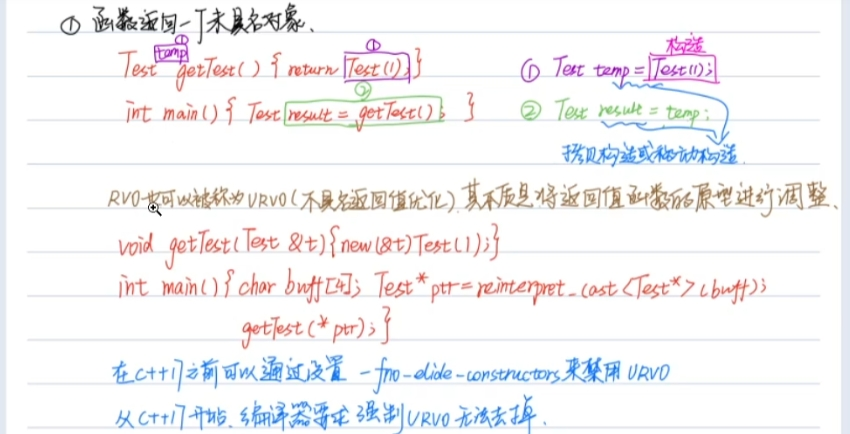

# const
    1. <font color=red>如果修饰的是变量不可变，就是顶层const， 否则是底层const(指针，引用)</font>
    2. 其中第二个const修饰的是 a变量不可变 顶层，而第一个修饰的是a指向地址内容不可变， 是底层const。
    3. **执行拷贝时，顶层const不受影响， 底层const必须一致**
    4. 理解底层const：就是一个const对象的地址或引用。 
        1. &a
        2. &b = b
        3. 两者都是将成为底层 const
```cpp
    const(1) int * const(2) a = new int(0);
    const int & c = 10; //底层const
    int *const b = a // 编译不过， 底层const不一样。
    //要看表达式，不知单看值
    const int a1 = 10;
    //编译不过，因为a1取地址后，变成底层const。
    int *a2 = &a1;
    //报错，因为把a1变成引用，其实是吧const 变成底层，和指针一样。 
    int &a3 = a1;
```
    5. 引用不是对象，不用拷贝，不满足上面条件。
    6. 常量引用如果在左侧，右侧可以接任何值
```cpp
    int &1 = 10;//错误，非cosnt引用必须用左值初始化。 
    const int &a = 10；//通过
```
    7. 如果引用出现在等号右侧，请忽略原表达式引用。
```cpp
    const int &a = 20;
    //此时a相当于 const int a 定义。所以会报错。
    int &c = a;
```
    8. const不构成重载 ？？
        1. 只针对于顶层const， 底层const是构成重载的。

# 值类型，右值引用
    1. 函数返回值是临时拷贝 对象，在不加优化的情况下， 及时返回的是全局对象，也是左值， 不可取地址。 
    2. 表达式类型
        1. 左值 - 可以取地址， 字符串
        2. 右值 - 
        3. x++是右值， ++x时左值，
    3. c++11 表达式类型

        1. std::move 结束对象的生命周期，move粗来的对象就是将亡值。
        2. <font color=red>如何得到将亡值- 将范左值强制转换 -- move底层就是static_cast</font>

    4. 赋值操作，只有拷贝一种方式吗
        1. 拷贝 
            1. 函数对象传入
            2. 函数返回
            3. 用=初始化一个新对象
        2. 引用
        3. 移动语义
    5. 类中没有实现移动构造， 即使用了move也是拷贝构造。
    6. 右值引用，是左值 - 这里说的是表达式本事，就是变量可以取地址。
    7. 只会对右值进行移动构造 - 关闭返回值优化
```cpp
get_pool(a){
    return a;
    //这里用的还是拷贝构造，因为a是左值
}
get_a(){
    int a;
    //这里才有移动构造
    return get_pool(a);
//只会对临时对象进行移动构造， 除非调用move。tmp就是临时对象。
    tmp = a;
    tmp1 = tmp;
}
```

# 数组指针
    1. 数组有单独的类型， 数组 与 <font color=red>**数组取地址是两个不同类型**</font>， 只有数组名才会退化， 数组地址不会，有自己的类型是个指针
 ```cpp
    //数组名不等于指针
    int array = {1, 2, 3, 4, 5};
    int * p = array; //数组名退化为指针
    //数组 的 指针， p1是个指针， 指向一个int数组有五个元素
    int (*p1) [5] = &array; //数组名取地址 ！=
 ```
    
 ```cpp
    //等价
    fun(int a[2]), fun(int a[]), fun(int *) 
    //不等价
    fun(int(*a)[4]), fun(int(*a)[5])
 ```
    3.  **数组和指针不是一个类型**， 赋值给指针也会退化为指针。 并且const意义会改变。-- <font color=red>当一个const数组退化为指针式， const由顶层变为底层。</font>
```cpp
    //报错， 字符串结尾有个结束符，所以这俩个类型不匹配
    //"abc"是 const char [4],没有退化为指针， 还是数组类型
    //所以const修饰的是 数组名不可变， 可以复制给char a[4];
    char a[3] = "abc";
    //但是, 下面的语句， "abc"便退化为了指针
    //变为 const char *， const是底层， 不可以如下赋值
    //可能不报错， 但是运行修改时会出现段错误。
    char *b = "abc"
```
    4. 没有引用数组， 只有指针数组
        1. 引用创建时必须初始化， 所以无法出现引用数组
        2. 第一条，7.

# 函数指针
```cpp
    //函数数据类型
    bool fun(int a, int b)//bool(int, int);
    //函数指针数据类型
    bool (*) (int, int);
    //函数取不取地址一样， 不用纠结，这破玩应就这样规定的
```
    1. 用using吧

# 类型推导
```cpp
//两者等价， 当T是指针时，都是顶层const， 修饰p不可变。
    template<typename T>
    void f(const T p);
    void f(T const p);
//const不构成重载
```
    1. 函数指针的底层const似乎只能用别名表示出来， 而且会被忽略掉。
        1. 可能因为函数本来就不可改百便，我想
```cpp
    //只能加顶层const
    int (*const fp)(int) = fun;
    //用别名才可以
    using f = int (int)
    const f *  = f;
```
    2. 类型推导
        1. ptype : 
            1. T, T*, T&, const T*, const T&；
                1. const T 与 T 
                2. T *const 与T*
                3. const T* const 与const T*
                4. 以上情况可以去掉 
            2. T&&, cosnt T&&
        2. expr:
            int
        3. 可以被忽略的const（顶层）， 在推导时会被忽略掉。
```cpp
    template <typename T>
    void f(ptype p);
    f(expr);
    
    //const区别
    const int a = 10;
    const int *b = &a;
    f(a); // p -> int
    f(b); // b -> const int * 
    //同理数组会退话未指针，注意字符串常量
    //会退化成 const char *,是底层const， 不会被忽略掉
```
    若函数声明时有引用， 则数组传进去不会退化。

    3. ptypr 分类
        1. T
        2. T* 
            1. 只接受指针类型，此时传入的类型去掉*就是T的类型
            例如 传入int *a， T = int。同样适用于顶层底层const。
        3. T&，不忽略const
```cpp
    //s虽说ca时顶层，但是转为指针，或引用时，就变为底层。
    const int ca = 20;
    f(ca); // T = const int
```
        4. const T *
            1. 只接受指针
```cpp
    //合法， 顶，底层const，可以乡下兼容
    //底层可以接受顶层。
    int *a = &c;
    f(a);
```
        5. const T &
            1. 常量引用，可以传入任何值
        6. T&& 
            1. 传入右值， <font color=red>ptype</font> 是 右值引用。
            2. 传入左值， ptype 是 左值引用。
```cpp
    //传入的是左值， 则ptype是左值引用 = int &
    //T&& = int & -> T = int &.
    int a = 0;
    f(a);
    //ptype = int &&, T -> int.
    f(1);
    //要看表达式的类型， 而不是值的类型
    const int &&a = std::move(x);
    f(z);
    //a表达式是左值，所以 ptype是左值引用
    // T -> const int &
```


# 区别使用（）{} 创建对象， 以后使用{}初始化。
    1. 列表初始化，不会进行额外拷贝。 
 ```cpp
    //会调用一次构造（强制转换吧）， 一次拷贝构造
    //而且只能接受一个参数
    A a = 10
    //多个参数初始化，而且还没有拷贝
    A a = {1, 2, 3};
 ```
    2. 不允许窄转换 
    3. 简化聚合类初始化
        1. 所有成员都是public
        2. 类中没有定义任何构造函数
        3. 没有类内初始化
        4. 没有基类， virtual
    4. 天生免疫解析问题
```cpp
void f(double value){
    //有两种解释方式
    //一个转换
    //一个函数声明，（允许参数被多余的括号包裹）
    int i(int(value));
    //用{}不i有问题
    classa t(classb());//会被错误解析
}
```
    5. 类内初始化不能用（）， 原因和上边4一样.
    6. 尽量用array代替数组，。而且array用{}初始化非简单类型时，要多加一个{}。
    7. initializer_list 蛋疼
        1. 禁止隐窄转换
        2. 总是优先匹配，即使会出错
        3. 空{}不会调用，ini。。。

# auto 类型， 优先使用auto
    1. 万能引用第二种写法 auto &&
    2. {}初始化，会被推倒成 initializer_list 
    3. {}无法进行模板推到， 要写成initializer_list<T>
    4. 可以返回值，但是模板推到规则
    5. 可以避免某些拷贝 - 万能引用背后产生的拷贝。
```cpp
    //不加const error， 万能引用可以接受所有值，但他要找些方法接受；
    //这其中可能有临时变量产生
    int a = 10;
    const float &b = a;
    //下面代码不像我们想的一样，拿的是引用，而是拷贝
    //因为map的key会变为，const std::string, 与我们传进去的不一样。
    std::unordered_map<std::string, int> m{{"hellow", 1}};
    for(const std::pair<std::string, int> &p : m){...}
    //auto不会
    for(auto &p : m){...}
```

# 优先使用using， 而非typedef
    1. 当编译器遇见 ::xx 这样的表达式，他不知道xx是一个类型，还是一个成员，
    必须等到实例化的时候才知道。但是为了处理模板，编译器必须知道。所以，typename可以告诉这是一个类型。默认是成员。
```cpp
struct a1{static int g;};
struct a2{typedef int g;};
//编译器在实例化前，不知道g是啥。
template <typename T>
class cm{
    T::g *ptr;
};
```
    2. using 不用 :: 运算符， 没有上述问题，所以对于模板来说，using更好用。 
```cpp
    //good
    template <typename T>
    using iv = std::vector<T>;
    //8ga
    template <typename T>
    struct iv{
        typedef std::vector<T> type;
    };
```

# move， forward
    1. move实现, forward实现
    2. move 意义告诉编译器，这个变量很适合被移动，但不强制。
```cpp
    template<typename T>
    decltype(auto) mymove(T && p){
        return static_cast<T&&>(p);
    //这写感谢不对， 当传入左值，T -> int&. 则返回值也为int &。
    //所以想法就是，去掉T中的引用， 只保留最原始的类型即可。
        using returntp = std::remove_reference_t<T> &&;
        return static_cast<returntp>(p);
    }
    //forward 实现
    template <typename T>
    T&& myforward(std::remove_reference_t<T> &p){
        return static_cast<T&&>(p);
    }
    template <typename T>
    T&& myforward(std::remove_reference_t<T> &&p){
        return static_cast<T&&>(p);
    }
    //直接进行强转是不对的, 因为无论如何在 f 中 p 是个左值，若直接写成万能模板强转，最后都会是T&。
    template <typename T>
    void f(T && p){
        my::forward(p);
    }
```
    3. forward <font color=red>函数重载中，与T &&规则不一样。函数重载是根据表达式值的类型，就是声明的东西。而T&&则是根据表达式的值。</font>
    所以forward应该如上实现。
```cpp
    void a(int &&);
    void a(int &);
    int &&c = 10;
    int b = 10;
    a(c); //调用第一个
    a(b); //调用第二个
```
    3. 对const进行move其结果还保留const，所以时候，即使move，也不一样调用相应的，函数，因为这个函数不是const， 而有其他的const版本更符合。比如拷贝构造，和移动构造。
 
# 引用折叠 - 两个引用折叠为一个
    1. 只要有一个左值引用，则结果就是左值引用 - 之前的观点是错误的，不能看数量。
 ```cpp
    template <typename T>
    void fun(T &&t){
        T &a = 10;
    }
    int a = 10;
    fun(a);
    //T && -> int &; -> T = int &
    //T &  -> int &,之前以为两个&会变成int。
 ```

# decltype
    1. decltype(a) -> a的所有东西都会被保留，不会退化。
    2. decltype(表达式) 
        1. 表达式左值， 得到结果对应的左值引用。
        2. 表达式右值， 得到结果对应类型。
        3. 以上两点很想，T &&， 推到中得出的T。
    3. decltype不会计算表达式的值。
    4. 表达式 
```cpp
    int a;
    //这不是表达式
    decltype(a);
    //这才是表达式
    decltype((a));
    decltype(10);
    //字面量， 字符串。是表达式。
```
    5. 应用
        1. 某些情况函数返回值无法提前得到。可以尾置返回值类型
        2. auto 自己就能进行返回值推到， 但是走的是模板的规则，所以要保留原来的类型，就用decltype（auto).
```cpp
    template<typane T>
    auto fun() -> decltype(T)  {
        return T{};
    }
    //例外，【】通常返回引用， 下面的特殊类型，返回值是个特殊东西， 用decltype方便很多
    std::vector<bool>
```

# 对象布局
    1. 影响对象大小因素
        1. 非静态数据成员
        2. virtual函数
        3. 字节对齐：
            1. 类中变量几个字节，这个变量就放在该大小的整数倍地址上。
            2. 结构体 会向最大的成元补齐。
            3. 有继承关系的补齐
```cpp
    struct a{int a; short b;};
    struct b : public a{short c;}
    //sizeof(b) == 12
    //为啥不等于8? 因为这样的话强制转换的时候会出问题，
    //每个类都要单独补齐，
```
    2. 虚表与RTTI
    1. A a = b -> 执行的是 static_cast -> 虚表变了， 无法实现多态
    2. A *a = &b -> 执行的是 reinterpret_cast
    3. 基类需要析构的话，一般定义为virtaul - 否则子类会有内存泄漏。


    3. RTTI：由于多态，一个函数的传入参数如果是指针（引用），有时要获取参数到底属于那个子类。用途。
        1. typeid 返回std::type_info，返回值只能用指针或引用接受。
```cpp
    std::type_info *base_tp = (std::type_info *)(((uint64_t*)(*(uint64_t*)(&a))) - 1)
    //等价
    typyid(a); //
```
        2. dynamic_cast 类之间转换，若不安全则返回nullpt(指针)， std::bad(引用)
    
# 显式类型转换
    1. static_cast - 编译期完成    
        1. 内置类型；任意类型的指针通过 void* 做媒介。
        2. 类：子->夫；但是会丢失多态特性。
        3. 类指针。随便转。下行不安全。
    2. dynamic_cast - 运行期
        1. 若不安全则返回nullpt(指针)， std::bad(引用)
        2. 必须有virtual函数， 因为判断是根据虚表第0条内容来实现， 所以必须要有虚函数才有序表；

    3. cosnt_cast - 编译期
        1. 去掉底层const， 但依旧不可以更改原指针指向的内容,那有啥用 ？？
        2. 用于函数重载，避免代码重复
```cpp
    //希望有const重载， 但做的内容一样，及只能写两段一模一样的代码。
    //所以可以写成下面的
    void a(const std:string &s){
        //...很多内容
    }
    void a(std::string &s){
        a(const_cast(const std::string&)(s));
    }
```
    4. reinterpret_cast
        1. 重新解释 - 模板和形参至少有一个是指针，引用。

# lambda 
    1. 底层原理
```cpp
    size_t sz = 0;
    auto Sizecmp = [sz](const string &a){return ...;};
    class Sizecmp{
        public:
            Sizecmp(size_t a) : sz(z) {}
            //注意const
            bool operator() (...) const {...;};
        private: size_t se;
    };
```
    2. 语法 
        [captures](params) specifiers exceptioin -> ret { body }
        1. specifiers 可选限定符 默认 const。捕获的东西不能修改，若想修改变为mutable。
        2. params 14 后 可以用 auto。
        3. captures 捕获列表
            1. 只能捕获非静态，局部。
            2. 捕获发生在定义的时候，而非运行时。
            3. 14 广义的捕获 [b=b] - 至此捕获列表可传右值
            4. this捕获类内；=捕获所有用到的；&；*this副本17；
            5. 捕获列表为空时，退化为函数指针。
    3. lambda表达式返回值用auto - 不知道他是啥类型。也可用std::function,但有性能损耗。

# 可调用对象
    1. 闭包：带上下文信息的函数。
    2. 可调用对象与function
        1. 可调用对象：函数；函数指针；lambda；std::bind;重载()运算符。
    3. 可调用对象都不同，有没有哪种方式可以容纳所有
        1. std::function 

# CRTP ， Expression Template
    1. 编译期多态！！！。

    2. 表达式模板 
        1. 延迟计算表达式， 从而可以将表达式传递给函数参数， 而不是传递计算后的结果。
        2. 节约计算中间结果的开销。
<https://blog.csdn.net/HaoBBNuanMM/article/details/109740504?spm=1001.2014.3001.5502>
```cpp
template <typename T>
class VecExpression{
    public:
        double operator[](size_t i) const {
            return static_cast<E const &>(*this)[i];
        }
        size_t size() const {return static_cast<E const &>(*this).size();}
}

class Vec : public VecExpression<Vec>{
        std::vector<double> elems;
    public:
        double operator[](size_t i) const {return elems[i];}
        double &operator[](size_t i){return elems[i];}
        size_t size() {return elmes.size();}
        Vec(size_t n) : elems(n) {}
        vec(std::initializer_list<double> init){
            for(auto  i : init)elems.emplace_back(i);
        }
        template <typename E>
        Vec(VecExpression<E> const &vec) : elem(vec.size()){
            for(size_t i=0; i!=vec.size(); ++i){
                elems[i] = vec[i];
            }
        }
}
//将自己作为基类模板参数的子类 - 对应表达式编译树中的二元运算符输出的内部节点
//该结构的巧妙之处在于模板参数E1 E2可以是VecSum，从而形成VecSum<VecSum<VecSum ... > > >的嵌套结构，体现了表达式模板的精髓：将表达式计算改造成为了构造嵌套结构
template <typename E1, typename E2>
class VecSum : public VecExpression<VecSum<E1, E2> > {
    E1 const& _u;
    E2 const& _v;
public:
    VecSum(E1 const& u, E2 const& v) : _u(u), _v(v) {
        assert(u.size() == v.size());
    }
 
    double operator[](size_t i) const { return _u[i] + _v[i]; }
    size_t size()               const { return _v.size(); }
};
//对应编译树上的二元运算符，将加法表达式构造为VecSum<VecSum... > >的嵌套结构
template <typename E1, typename E2>
VecSum<E1,E2> const operator+(E1 const& u, E2 const& v) {
    //只是创建一个对象，并不进行计算。
   return VecSum<E1, E2>(u, v);
}

int main() {
 //创建3个叶子节点
 Vec v0 = {1.0, 1.0, 1.0};
 Vec v1 = {2.0, 2.0, 2.0};
 Vec v2 = {3.0, 3.0, 3.0};
 
 //构建表达式 v0 + v1 + v2，赋值给v3，编译阶段形成表达式树
 // V3 类型为 VecSum<VecSum<Vec, Vec>, Vec>;
 auto v3 = v0 + v1 + v2;
 // 这样写就会计算，因为调用了Vec initializer_list构造函数;
 Vec v4 = v0 + v1 + v2;

//输出结算结果
 for (int i = 0; i < v3.size(); i ++) {
    std::cout <<" "<< v3[i];
 }
  std::cout << std::endl;
}
```


# 优先考虑nullptr
    1. NULL 是long类型
    2. 函数重载 0 -> int, nullptr -> int *, NULL 匹配 long。
    3. 模板里不能将 0， NULL 代表 空函数指针。
```cpp
    int a(int); int a(bool); int a(int *);
    // NULL 可以转换成上面三种，会报错
    a(NULL);
```

# 构造函数语义学
    1. 编译器如何完善构造函数
        1. 声明时初始化的成员， 编译器将其安插进构造函数。
        2. 基类，非静态成员未初始化，但存在默认构造函数，插入。
        3. 虚表构造。
    2. 若没有构造函数  
        1. 若有上述1提到的情况， 合成默认构造函数。
        2. 只要定义了一个构造函数，就不会自动合成默认。
    3. 基类没有默认构造函数，子类需要手动初始化。
    4. 使用using去掉子类冗余构造函数。

# 理解特殊成员函数的生成

    1. 3 5 法则。 默认生成的拷贝， 赋值函数都是按位copy。
    2. 生命其中一个，也应该把其他四个都声明出来
    3. 若起初都用的是move构造（默认生成的），但是突然在类中加了一个析构，拷贝，赋值函数 （默认生成的会消失），则原先的移动可能变成copy；
    4. 没有析构函数，她一定会自己生成。- 一定有析构函数。 


# 尽可能使用 constexpr
    1. const 不确定性
```cpp
    int e = 10; const int a = 10; //编译期常量
    const int e1 = e;//运行期常量
```
    2. constexpr 保证声明的变量是编译期常量。一定是常量。
    3. constexpr 函数: 
    c11
        1. 不能是void
        2. 函数只能有一个 return 语句 return expr。。
        3. 如果传入的不是constexpr，则退化成正常函数。函数声明时不用加 cosntexpr。
        4. 构造函数
            1. 初始化列表必须是常量表达式。
            2. 函数体必须为空。
            3. 所有相关的成员 析构函数必须都是默认的。
        5. 成员函数 - 也具有 const属性
    c14
        1. 打破 1，2，4.2， 5
        2. 可以修改生命周期和常量表达式相同的对象。

# 异常处理

    1.  

# swap & copy

    1.  考虑异常安全。
```cpp
    void swap(Buffer &a, Buffer &b){
        //规范写法，这样写可以让编译器找到更加复合的特化函数。
        using std::swap;
        swap(a., b.);
    } 
    class Buffer{
        public:
            size_t size_;
            size_t capacity_;
            int *buf_;
        public:

            friend void swap(Buffer &a, Buffer &b);
            ~ Buffer () {
                delete [] buf_;
            }
            Buffer(size_t cap) noexcept : capacity_(0), size_(0), buf_(nullptr) {}

            Buffer (const Buffer &buffer) : size_(buffer.size_), capacity_(buffer.capacity_), buf_(capacity_ ? new int [buffer.capacity_] : nullptr){
                std::copy(buffer.buf_, buffer.buf_+buffer.capacity_, buf_);
            }
            //移动构造，构造函数的递归调用， 首先调用第一个构造函数
            //创建出一个临时对象，没申请内存，之后与传入的对象进行交换。
            Buffer(Buffer &&buffer) noexcept : Buffer(0){
                swap(buffer, *this);
            }

            // buffer_a = buffer_b;
            //注意这里不是const 引用
            //传入左值，调用拷贝构造函数，buffer申请了内存，之后与this交换，由于buffer是临时对象，结束后自动析构。
            //传入右值，调用移动构造 
            Buffer &operator= (Buffer buffer){
                swap(buffer, *this);
                return *this;
            }
    };
```

# 如果没有异常， 就声明为noexcept
    1. vector在扩容的时候，会用 复制或移动 操作，如果移动操作不是noexcept， 那vector 不会进行move。

# 只用限域enum， 而非不限域
    1. enum每个类型都是由编译器决定的整形。
    2. 非限域问题
        1. 全局；可隐式转换； 
    3. enum class ENUM : int {} - 限域写法。 - 不可隐式转化。

# 友元

# 优先使用delete； 而不是写成private（因为友元可以通过编译， 但是在连接时会报错，因为没有实现）
    1. 希望删掉一些模板特化，用delete。
     
# override
    1. 基类是virtual
    2. 函数名形参。。相同。
    3. 返回值兼容（子类，基类指针引用）
    1. 引用限定符相同

# 优先考虑const_iterator 

# 内存申请方法
    1. new 比 malloc 多了两步：强制转换；调用构造函数；
    1.  placement new

# 重写new运算符意义
    1. 每次malloc都会由边界信息。如果类申请的数量多，不如一次性申请多个，之后每次new从开始申请的空间中往外拿。

#  delete 不加 【】会泄露的情况
    1. 会把占用的内存释放掉， 但是只会调用数组第一个 元素 的 析构函数。- 若元素是类。而且是反着析构，若不加 【】 则从第一个析构， 这样就会有pointer 错误；

# unique_ptr
    1.  不能拷贝， 只能移动； 删除器卸载模板中
    2. 自定义删除器，可能会导致，unique_ptr尺寸变大，因为lambda有捕获列表；
    3. 返回值不用加 move 原因
        1. 因为返回值会调用移动构造函数；
        2. 编译器优化直接构造；
        3. 但是作为函数参数，因为要传进去成为一个左值，所以必须使用move；
    4. 支持数组

# shared_ptr
    1. 内部有两个指针, 都在堆中分配， 
        1. 数据指针
        2. control_block 
            1. reference_count
            2. weak_count
            3. other_data
        3. 所以shared 大小不变。删除写在，构造函数中。
        4. 性能问题
            1. 大小堆内存
            2. 改变count要原子操作
        5. control_block生成时机
            1. std::make_shared
            2. unique_ptr
            3. 构造函数 传入 原始指针 - 只有这一个构造函数会生成新 block；
        6. 存在的问题 - 互相引用
            1. 两个block与同一个原指针关联，则会释放两次；
            2. 使用this指针作为构造 shared_ptr实参； share_from_this;
        7. 不支持数组

# share_ptr 可能悬空时， 使用weak_ptr

    1. weak_ptr 只能用share 初始化, 而且不会影响内存释放；
    2. 可以调用 expire 函数查看资源是否被释放。
    3. weak也不可以直接使用，只能先用lock转成share
    4. weak起到监视的作用，比如希望用 map 缓存一些类的share指针，则value用weak更好；

# 优先使用 make_unique

    1. 减少代码重复
    2. 可以减少一次 malloc， 在share中；
    3. 问题
        1.

# Pimpl


    1. share 不会上述问题

# 区分通用引用和右值引用
    1. 模板的通用引用 - 只有一种形式 = T&& + 类型推导 - 不能把类型写死。
```cpp
template <typename T
void fun(T && p); //只能是这样，不能加任何其他的东西
fun<int>(10) //ok
fun<int>(a) //error
```
    2. 可变参数模板 T&&... + 类型推导
    3. auto&& + 类型推导

# 返回值优化
    1. 返回一个未具名对象

    2. 返回一个具名对象：对于第二种优化，若是创建的对象中间有操作，则在要传出的对象上进行操作。


# 返回值优化失败 - （NRVO）
    1. 可能返回不同的对象 
    2. 返回全局变量
    3. 返回函数 引用参数 - 此时要用 move
    4. 存在赋值行为；不能用已经构造好的对象接， 因为里面的优化就是在新地址上重新构造，会覆盖原先的内容，若原来里面有指针，可能泄露；
    5. 返回成员变量
    6. 使用 std::move 返回 - 除了上面的情况 不用 move

# 对右值引用使用move， 有通用引用使用forward
    1. 不高效的原因：传入的不是直接的对象，不如接受string， 而传入的是 "hellow"
```cpp
    setname(const std::string &s){
        name = s;
    }
    setname("Hellow");
    //string tmp = "hellow" // 构造
    //name = std::move(tmp); // 多余的一次移动操作
    //万能引用
    template <typename T>
    setname(T && s){
        //T -> cosnt  char (&) [8]
        //直接 调用 相应的 operator=
        name = std::forward<T>(s);
    }
```


# emplace_back push_back


# 避免在通用引用上重载
    1. 对于通用引用的重载， 如果不需要类型转换则走正确的版本，否则走通用引用的版本。

# 通用引用重载方法

# 模板元编程，SFINAE， enable_if
    1. SFINAE 替换失败并非错误


# 对于移动成本低， 而且总是被拷贝的可拷贝形参， 考虑按值传递。
    1. 对于不可拷贝， 只用右值传递参数 - unique_ptr

# 假定移动操作不存在， 成本高， 未被使用
    1. 移动操作高效的原因是 - 类内有指针（堆区的）， 不用深拷贝，只改指针。一旦在栈区，因为是自动释放， 所以还是得拷贝，否则可能被释放掉。
    1. std::array 移动操作 - 存在栈区
    2. 当 string 字符少时，有小字符串优化 - 也会存在栈区
    3. move没有声明为 noexcept - 容器内不敢用；

# extern
    1. 变量声明， 定义形式一样， 所以用extern来修饰声明；

# static
    1. 普通函数，变量 - 只在当前文件可见
    2. 局部变量 - 不会随着函数结束而销毁；
    3. 成员函数 - 既能用类名访问， 又能用类访问 - 只能调用静态属性
    4. 成员 - 类内声明， 类外定义；
    5. const static 可以在 类内 =， 但这也只算一个声明；

# 完美转发失败
    1. {} 初始化临时对象
    2. 0，NULL 作为空指针
    3. 仅声明， 未定义的static const 成员；
    4. 重载函数名称与模板 

# lambda 避免使用默认捕获 - 不要直接写个 =或&


# push_back 与 emplace_back
    1. emplace 直接在原地构造 - 如果满足条件
        1. 是通过构造函数传入， 而不是直接赋值 传入容器内元素类型）
        2. 这样即使传入构造函数， 也不可能在原位置构造， 只能是移动， 赋值。
        3. 拒绝重复项的容器， emplace， push没有差异。


    2. 可能内存泄漏


    3. emplace 可以跳过 explicit

# 随机数生成
```cpp
std::mt19973 rng;
std::uniform_int(real)_distribution<int> uni(1, 1024);
suze_t random_ = uni(rng);
```

# end 
  