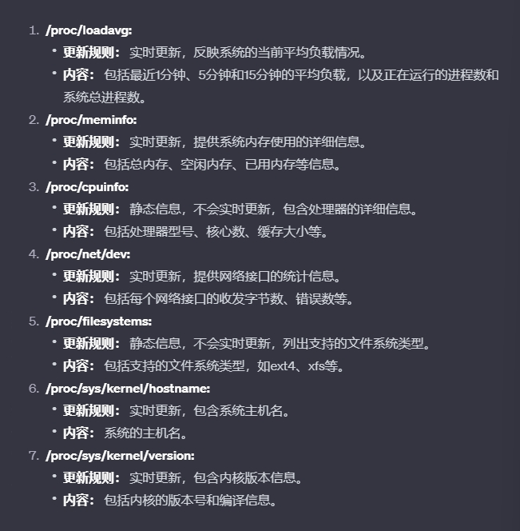

# 交互问题 
1. 如何从 docker 中 传出 qt界面 - 
    docker run 设置环境变量
    -e DISPLAY=$display ， DISPLAY=:0;Xserver服务器

    进入docker 的时候
    xhost +local:root 1>/dev/null 2>&1
    代表允许本地 Xserver 服务器接收 docker 中的链接

# CMake 相关
1. find_package(protobuf CONFIG REQUIRED) - 会找到 protubuf 对应的 CMakeLists.txt 文件， 这样就可以用里边的函数
    1. protobuf: 表示要查找的包的名称，这里是 Protocol Buffers。
    2. CONFIG: 表示要查找的是配置文件（.cmake 文件），而不是传统的 Find 模块。
    3. REQUIRED: 表示这个包是必需的，如果找不到会报错。
2. 函数 例如 protobuf_generate(
                TARGET monitor_proto 
                LANGUAGE cpp)
3. add_library - 会生成 库文件 target， 但是源文件可以是其他，比如用 .proto;

4. 获取 gRPC::grpc_cpp_plugin 的 LOCATION， 放入变量
```cpp
get_target_property(
    grpc_cpp_plugin_location 
    gRPC::grpc_cpp_plugin LOCATION
)
```
5. set_target_properties(display PROPERTIES AUTOMOC TRUE)


6. ${CMAKE_CURRENT_BINARY_DIR} - 正在构建的目录地址 例如(/build/proto)


# 


# 字段相关


--
```cpp
message CpuLoad {
    //代表过去 k 分钟 平均负载
    //平均负载： 运行队列中平均进程的数量
    float load_avg_1 = 1;
    float load_avg_3 = 2;
    float load_avg_15 = 3;
}

message SoftIrq {
    //表示软中断所在的 CPU
    string cpu = 1;
    //表示高优先级软中断的执行时间比例
    float hi = 2;
    //表示定时器相关软中断的执行时间比例。
    float timer = 3;
    //表示网络传输（发送）相关软中断的执行时间比例
    float net_tx = 4;
    //表示网络接收相关软中断的执行时间比例。
    float net_rx = 5;
    //表示块设备 I/O 相关软中断的执行时间比例
    float block = 6;
    //表示中断轮询相关软中断的执行时间比例
    float irq_poll = 7;
    //表示任务队列相关软中断的执行时间比例。
    float tasklet = 8;
    //表示调度器相关软中断的执行时间比例
    float sched = 9;
    //表示高精度定时器相关软中断的执行时间比例。
    float hrtimer = 10;
    //表示 RCU（Read-Copy Update）相关软中断的执行时间比例。
    float rcu = 11;
}

message CpuStat{
    //表示 CPU 的名称或标识
    string cpu_name = 1;
    //表示整个 CPU 使用率的百分比
    float cpu_percent = 2;
    //表示用户空间占用 CPU 使用率的百分比。
    float usr_percent = 3;
    //表示系统空间占用 CPU 使用率的百分比。
    float system_percent = 4;
    //表示“优先级较高”进程占用 CPU 使用率的百分比
    float nice_percent = 5;
    //表示 CPU 空闲时间的百分比。
    float idle_percent = 6;
    //表示 CPU 在等待 I/O 操作完成时的百分比。
    float io_wait_percent = 7;
    //表示 CPU 处理硬中断的百分比。
    float irq_percent = 8;
    //表示 CPU 处理软中断的百分比。
    float soft_irq_percent = 9;

}

message MemInfo {
    //表示总内存大小。
    float total = 1;
    //表示空闲内存大小。
    float free = 2;
    //表示可用内存大小。
    float avail= 3;
    //表示缓冲区使用的内存大小。
    float buffers = 4;
    //表示缓存使用的内存大小。
    float cached = 5;
    //表示交换空间中缓存的内存大小。
    float swap_cached = 6;
    //表示活跃内存大小
    float active = 7;
    //表示非活跃内存大小。
    float inactive = 8;
    //表示活跃的匿名内存大小。
    float active_anon = 9;
    //表示非活跃的匿名内存大小
    float inactive_anon = 10;
    //表示活跃的文件内存大小。
    float active_file = 11;
    //表示非活跃的文件内存大小
    float inactive_file = 12;
    //表示脏页面的内存大小
    float dirty = 13;
    //表示写回的内存大小。
    float writeback = 14;
    //表示匿名页面的内存大小。
    float anon_pages = 15;
    //表示映射文件的内存大小。
    float mapped = 16;
    //表示可回收的内核内存大小。
    float kReclaimable = 17;
    //表示可回收的系统内存大小。
    float sReclaimable = 18;
    //表示不可回收的系统内存大小。
    float sUnreclaim = 19;
    //表示内存使用率的百分比。
    float used_percent = 31;
  }

  message NetInfo {
    //表示网络接口的名称。
    string name = 1;
    //表示发送速率。
    float send_rate = 2;
    //表示接收速率。
    float rcv_rate = 3;
    //表示发送数据包的速率。
    float send_packets_rate = 4;
    //表示接收数据包的速率。
    float rcv_packets_rate = 5;
  }
```