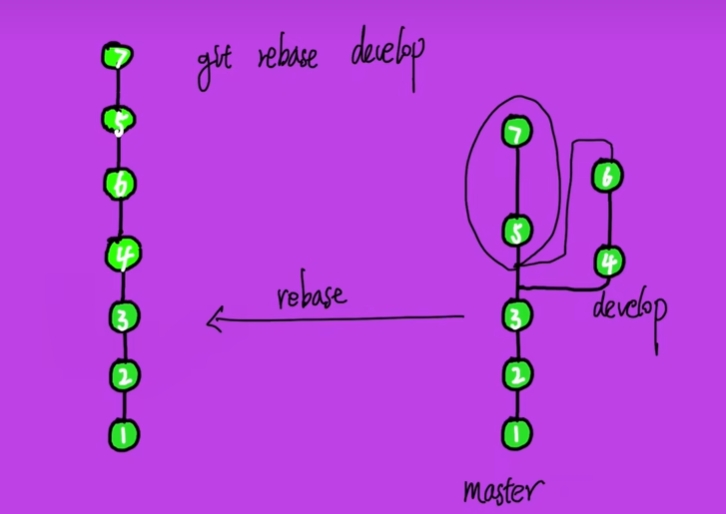
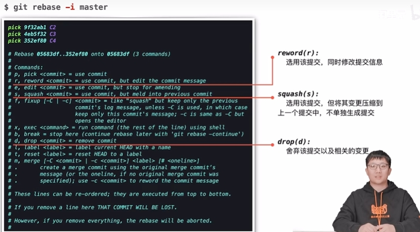
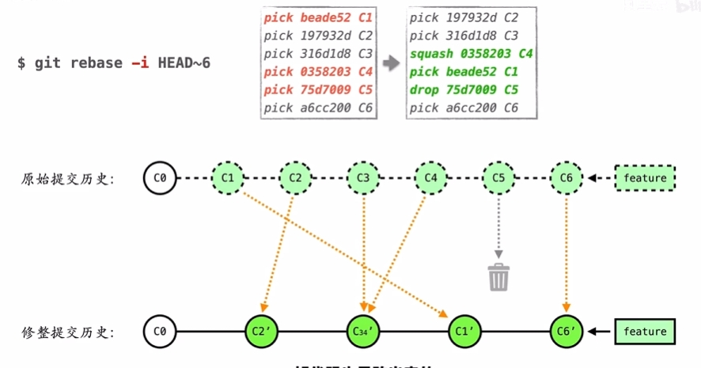
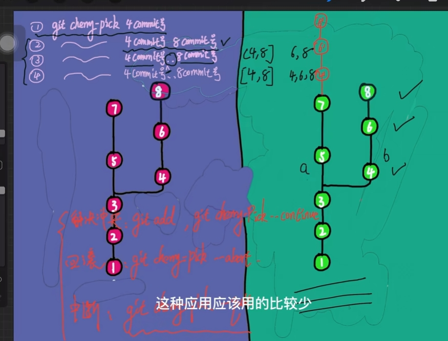

# 数据格式，独立语言与平台
    1. 数据持久化
    2. 网络数据传输
[教程](https://subingwen.cn/cpp/protobuf/).

# git
## 分区
    1. 为啥要有暂存区 ？
        1. 假如一次开发了很多功能， A(修改文件)， B(添加新文件-没开发完呢)，我不想把没开发玩的，和开发完成的一块提交上去，显得很乱，所以可以把完成的提交上去，把未完成的放在暂存区；
    2. git reset
        1. --soft: 版本库 -> 暂存区
        2. --mix：版本库 -> 未暂存区
        3. --hard: 版本库 -> 丢弃

        

# git 面试题
1. 简单对比 git pull 和 git pull --rebase 的使用
    1. git pull = git fetch + git merge
    2. git pull --rebase = git fetch + git rebase

2. git merge和git rebase的区别。- 不在远程分支，公共上rebase，只在本地rebase；
--

--

2. git rebase -i
--

--

3. 什么时候使用“git rebase”代替“git merge”？
    1. 自己开发分支一直在做，然后你想把主线的修改合到你的分支上，做一次集成，这种情况就用rebase比较好，把你的提交都放在主线修改的头上;
    2. rebase会把你当前分支的commit放到公共分支的最后，所以叫做变基。就如同你从公共分支又重新拉出来这个分支一样。
    3. merge会把公共分支和你当前的commit合并在一起，形成一个新的commit提交。- 菱形

4. 拉取请求（pull request）”和“分支（branch）”之间有什么区别
    1. 分支（branch） 是代码的一个独立版本。
    2. 拉取请求（pull request） 是当有人用仓库，建立了自己的分支，做了些修改并合并到该分支（把自己修改应用到别人的代码仓库）。- PR

5. git cherry-pick，有什么作用， 从其他分支 摘取某几个提交，放在结尾；
    1. 合并单个提交：当我们只想应用某个分支上的一个提交到当前分支时，可以使用cherry-pick命令，而不需要合并整个分支。
    2. 提取特定功能，修复bug：当我们在一个分支上改变，并希望将这个修复应用到其他分支上时，可以使用cherry-pick命令。
    3. 注意 （cherry-pick会创建一个新的提交，因此可能会引入冲突）（cherry-pick只能应用一个提交，如果要应用多个提交，可以使用git rebase -i命令进行交互式变基。）
    4. merge,rebase 是整个分支维度的
--

--

6. .gitignore 文件 - 自动忽略里面的文件

7. 如何把本地仓库的内容推向一个空的远程仓库？
    1. git init
    2. git remote add origin remote_address
    3. git add .
    4. git commit -m "describution"
    5. git push origin master

8. 提交时发生冲突，你能解释冲突是如何产生的吗？你是如何解决的？
    1. 提交冲突: 提交的时候 版本库的版本 小于 远端仓库 - 和当时 拉下来的 版本 不一致； 
    2. 如何解决 - git pull (--rebase) - 新创建一次提交（vim添加commit信息）
        1. 能自动合并的冲突 - 没更改相同的部分
        2. 不能自动合并冲突 - 手动修改
            1. git pull 失败 状态变为MERGING
            2. 手动处理冲突
            3. git add ., git commit

9. git提交代码时候写错commit信息后，如何重新设置commit信息？
    1. 通过git commit --amend 来对本次commit进行修改。

10. 分支相关命令
    git branch, git checkout bname, git push origin bname

11. 如何查看文件的提交历史和分支的提交历史
    1. git log filename
    2. git log branch 

12. your-branch-is-ahead-of-origin-master-by-3-commits
    1. 没commit

13. git reset
    1. 未提交的文件 - git restore， git checkout
    2. 已add的文件 - git reset，git restore --stage
        1. 一步到位直接把硬盘上的也改了 - git checkout HEAD
    3. 已经commit 
        1. -  git reset - 别再公共分支上使用
            1. --soft:  -> 暂存区 - 退回到未commit状态
            2. --mix： -> 未暂存区 - 退回到未add状态
            3. --hard:  -> 丢弃硬盘上的修改
        2. - git revert 增加一个 commit 与之前的效果相反
            1. 可以去掉某一个commit - 增加一个 -commit
            2. 在共有分支上删除某一个之前的分支 - 不能直接删除
