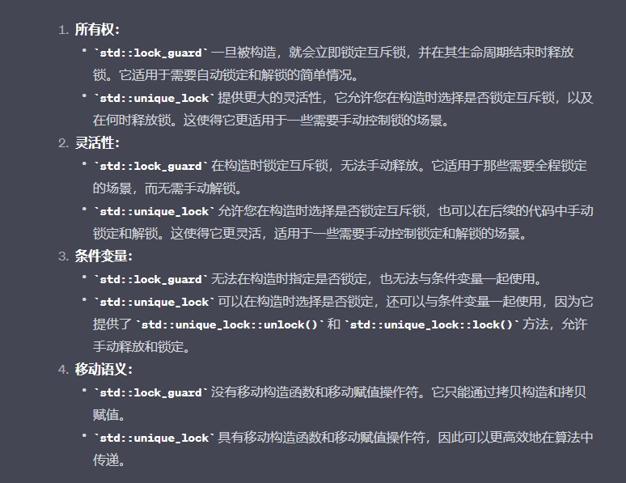
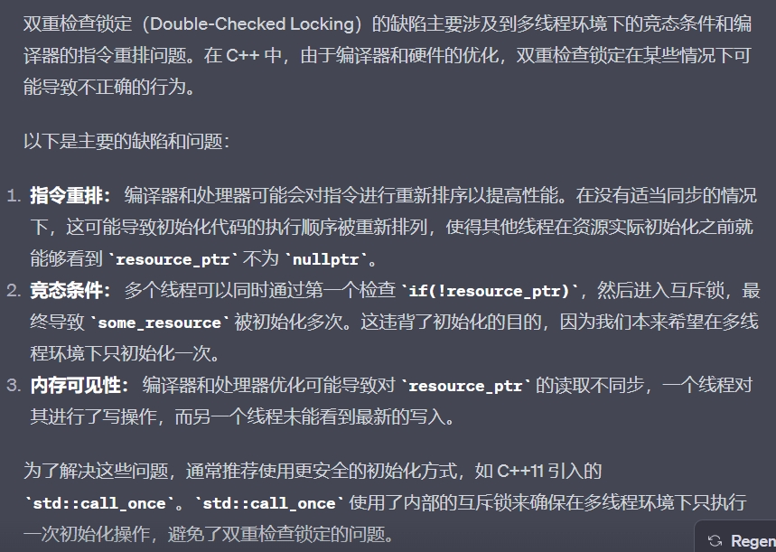

C++标准并未对进程间通信提供任何原生支持，所以使用多进程的方式实现，这会
依赖与平台相关的API。

 std::thread 可以用可调用类型构造，将带有函数调用符类型的实例传
入 std::thread 类中，替换默认的构造函数;，提供的函数对象会复制到新线程的存储空间当中

3. 转移线程所有权
    1. 不能通过赋一个新值给 std::thread 对象的方式来"丢弃"一个线程。
```cpp
class scoped_thread{
    std::thread t;
    public:
    explicit scoped_thread(std::thread t_): // 1
    t(std::move(t_)){
        if(!t.joinable()) // 2
        throw std::logic_error(“No thread”);
    }
    ~scoped_thread(){
        t.join(); // 3
    }
    scoped_thread(scoped_thread const&)=delete;
    scoped_thread& operator=(scoped_thread const&)=delete;
};
struct func; // 定义在清单2.1中
void f(){
    int some_local_state;
    scoped_thread t(std::thread(func(some_local_state))); // 4
    do_something_in_current_thread();
}
```

# 互斥量 mutex
    1. lock_ground - RAII
    2. 一个互斥量，可以在同一线程上多次上锁。
    3. c++ 17以前 避免死锁写法
```cpp
std::lock(lhs.m,rhs.m); 
std::lock_guard<std::mutex> lock_a(lhs.m,std::adopt_lock);
std::lock_guard<std::mutex> lock_b(rhs.m,std::adopt_lock);
```
    4. 避免死锁
        1. 避免嵌套锁
        2. 以固定的顺序获取锁
        3. 使用锁的层次结构 - 只能高等级的锁，持有低等级的
```cpp
hierarchical_mutex other_mutex(6000);
```
    5. std::unique_lock
```cpp
std::unique_lock<std::mutex> lock_a(lhs.m,std::defer_lock);
std::unique_lock<std::mutex> lock_b(rhs.m,std::defer_lock);
std::lock(lock_a,lock_b); // 2 互斥量在这里上锁

```


# unique_lock - lock_guard


# 保活共享资源初始化过程
    1. 使用 std::call_once - 不可拷贝和移动 还有mutex


# 保护不经常更新的数据结构
    1. 读 - 写
    2. c++14 std::shared_timed_mutex
    3. std::shared_lock<std::shared_timed_mutex>


# 同步并发操作
    1. 条件变量 std::condition_variable 和 std::condition_variable_any 
    2. wait()会去检查这些条件(通过调用所提供的lambda函数)，当条件满足(lambda函数返回true)
时返回。如果条件不满足(lambda函数返回false)，wait()函数将解锁互斥量，并且将这个线程
置于阻塞或等待状态.
    3. 当准备数据的线程调用notify_one()通知条件变量时，处理数据的线程从睡眠状态中苏醒，重新获取互斥锁，并且再次检查条件是否满足。在条件满足的情况下，从wait()返回并继续持有锁
    4. 这就是为什么用 std::unique_lock 而不使用 std::lock_guard ——
等待中的线程必须在等待期间解锁互斥量


# 对于与传入的可调用对象 是直接 拷贝进去的，所以主线程消失时，这个对象（operator（）的类或者lambda表达式）不会消失。但是，在对象里面的引用，指针可不是，所以里面的成员会出问题。

# 线程参数传递， detach() 坑 - 少用detarch
1. 就算线程函数声明参数是引用， 直接传入std::thread()中取得参数也是拷贝。
2. 那如何传递字符串？？？？
    1. 如果用std::string 接， 那有可能在字符数组已经析构的情况下， 再去转换 - 未定义行为
3. <span style="color: red;"> 一般化：线程函数要求一个对象， 可以被其他类型来隐式构造， 这样在主线程中，若用一个局部变量传入thread去构造需要的类，则不能保证，在主函数结束前，这个类被构造出来。这样结束后构造，就有未定义行为；</span>
4. 解决方法， <span style="color: red;">直接在传入的时候构造-临时变量， 不让他自动隐式转换 - std::thread(.., std::string{"aaa"});</span>
5. --避免隐式类型转换(隐式转换的构造是在子线程中完成的). --不推荐用引用（除了类对象）， 绝不可以用指针。

# 线程id
1.   std::this_thread::get_id()

# 传递对象 与 智能指针
1. std::ref(); - 这样才能真传入引用。
2. 智能指针 - std::move
    
# 成员函数指针做可调用对象
1. ClassA a; std::thread(&ClassA::funcA, &a/(std::ref(a))); 

# 创建和等待多个线程

# 多个锁
1. std::lock() 要不都获取， 要不一个都不获取；
2. std::adopt_lock - std::defer_lock
```cpp
std::lock(lhs.m,rhs.m); 
std::lock_guard<std::mutex> lock_a(lhs.m,std::adopt_lock);
std::lock_guard<std::mutex> lock_b(rhs.m,std::adopt_lock);

std::unique_lock<std::mutex> lock_a(lhs.m,std::defer_lock);
std::unique_lock<std::mutex> lock_b(rhs.m,std::defer_lock);
// 1 std::defer_lock 留下未上锁的互斥量
std::lock(lock_a,lock_b);
```

# unique_lock
1. 第二个参数
    1. std::adopt_lock  - 表示mutex已经被lock。 否则报异常；
    2. std::try_to_lock - 尝试上锁， 若失败， 则立即返回；
        使用 if(lock.onws_lock())  判断
    3. std::defer_lock  - 初始化一个没加锁的mutex - 只绑定不加锁；

2. 成员函数
    1. lock(), unlock(). try_lock()
    2. release()解除绑定， 返回mutex - 若已经加锁， 则后面的需要负责管理；

# 单例设计模式 - 最好在主线程中创建实例
```cpp
class MyCAS{
    private:
        static MyCAS *cas_instance_
    public:
        static MyCAS *GetInstance(){
            if(cas_instance_ == nullptr){
                cas_instance_ = new MyCAS{};
                static GarbageRecycle gc;
            }
            return cas_instance_;
        }
        //C++11及以后标准下，静态局部变量初始化是线程安全的
        static MyCAS *GetInstance(){
            static MyCAS instance;
            return &instance;
        }
        class GarbageRecycle{
            public:
                ~GarbageRecycle () {
                    if(MyCAS::cas_instance_ != nullptr){
                        delete MyCAS::cas_instance;
                        MyCAS::cas_instance_ = nullptr;
                    }
                }
        };
        MyCAS(const MyCAS &) = delete;
        MyCAS& operator=(const MyCAS&) = delete;
    private:
        MyCAS () {}
};
MyCAS * MyCAS::cas_instance_ = nullptr;
```
# std::call_once() - 保证 fun只被调用一次；
```cpp
void fun ();
std:::once_flag
std::call_once(once_flah, fun);
```

# 条件变量
1. std::condition_variable
2. wait()
    1. 有第二个参数 - 返回true不用等待，一直持有锁； 返回false 释放锁并阻塞；
    2. 没有第二个参数 - 解锁互斥量，阻塞；

3. notify_one() - 尝试唤醒wait阻塞的线程
    1. 线程得到通知后， 尝试重新获取锁，再次检查；
    2. 没有计数器， 如果另一个线程不是正好卡在wait处， 那麽这次notify_one()可能没效果；
4. notify_all()

# std::async - 希望线程返回一个结果 std::future
1. 用来启动一个异步任务(不会卡住，直到调用get()-只能调用一次，多次报异常，（若没执行完）才可能卡住) - 返回一个 std::future
2. 可以额外传递一个 std::launch
    1. std::launch::deferred - 函数直到get()，wait()才会调用.并且不会创建线程 - 只是在主线程中调用入口函数；
    2. std::launch::async    - 开始就创建线程；
    3. 组合 - 两个都有可能， 自行决定；
    4. 不指定 - 默认值就是组合；
```cpp
    std::future<int> res = std::async(func);
    res.get(); // 只能调用一次
```
3. 与std::thread 区别
    1. thread一定会创建新线程，不好拿返回值 - package_task ； 
    2. 由于资源有限，可能会失败；
    3. 用async不会报异常，会自己判断，创不创建新线程；

4. 不确定性
    1. 默认不一定创建新线程；
    2. res.wait_for(std::chrono::milliseconds(0) (0s) ) 判断究竟是哪种方法；


# std::future - 如果调用get()没得到结果，那就卡住等待
1. std::future_status status = ful.wait_for(std::chrono::seconds(1)); - 卡住
    1. timeout, ready, deferred(async第一个参数相关)
2. valid() - 是否被get()过

2. std::shared_future  - 可以 get() 多次；

# std::packaged_task<T>-模板参数是各种可调用对象-本身也是可调用对象，可以直接调用；
1. 包装各种可调用对象， 方便作为入口函数
2. 用get_future()， 获得std::future<>;
```cpp
std::package_task<int(int)> mypt(func);
std::thread th_(std::ref(mypt), 1);
th_.join();
std::future<int> res_ = mypt.get_future();    
int res_ = res.get();
```

# std::promise - 在某个线程中赋值，在其他线程中取出来
1. set_value() - get_future()
```cpp
void thread_1(std::promise<int> &t, int calc){
    calc *= 2;
    calc -= 3;
    calc *= 12;
    t.set_value(calc);
    return;
}
void thread_2(std::future<int> &ft){
    //balabalabalbalbal


    int t = ft.get();
}
int main(){
    std::promise<int> myp;
    std::thread t1(thread_1, std::ref(myp), 8);
    std::future<int> ful = myp.get_future();
    std::thread t2(thread_2, std::ref(ful));
    t1.join();
    t2.join();
    //int t = ful.get(); 
}
``` 

# std::atomic - 针对单个变量 
1. x = x + 1; - 会错误； 只针对 ++ += 符合操作支持；


# mutex 与 atomic 使用场景的选择：
1. 如果需要对一块代码或者一段逻辑进行互斥访问，保护共享资源，那么使用 std::mutex 是更为合适的选择。
2. 如果只需要对一个变量进行一些简单的原子操作，而不需要对一段逻辑进行互斥访问，那么可以考虑使用 std::atomic。


# 可以重载 operator ""， 实现 1ms 类似的东西；

# mutex.lock() 不允许被连续调用两次

# recursive_mutex - 递归独占互斥量
1. 同一线程可以多次lock();

# timed_mutex - recursize_timed_mutex
1. 有超时功能
2. try_lock_for() - 得到锁或者超时，就继续走下去
3. try_lock_until() - 等待到指定时间点，其他和上面一样；

# 虚假唤醒 - 被唤醒的时候，已经没有数据了
1. wait(), notify_one(), notify_all()

# 线程池

# 多线程环境中 - 不要在构造函数中暴露出去this指针，可能没构造完就被别人使用了

# 多线程环境中 析构函数 - 难
1. mutex 在析构函数中不是办法 - 只能用于同步本 class 的其他数据成员的读和写，它不能保护安全地析构。 - 尤其是有继承关系 - 其实析构函数本意上不需要保护，因为他就是在没用的时候采取执行；
2. 一个函数如果要锁住相同类型的多个对象，为了保证始终按相同的顺序加锁，我们可以比较 mutex 对象的地址，始终先加锁地址较小的 mutex。
3. shared_ptr/weak_ptr
    1. weak_ptr 不控制对象的生命期，但是它知道对象是否还活着如果对象还活着，那么它可以提升为有效的shared_ptr；如果对象已经死了，提升会失败，返回一个空的 shared_ptr提升/lock()”行为是线程安全的。
    2. 引用计数 本身 是安全且无锁的，但对象的读写则不是，因为shared_ptr 有两个数据成员，读写操作不能原子化。
    3. 通常用 const shared_ptr<T>& 传递参数
    4. enable_shared_from_this - 如何获得一个指向当前对象的 shared_ptr<StockFactory> 对象呢？ - 对象必须在heap上；
    5. 弱回调 - 4 改为weak_ptr

# 可重入锁需要具备哪些特征 ， 如何实现公平锁 ？
    1. 原子类型的计数器
    2. 加一个队列 - 先来先服务