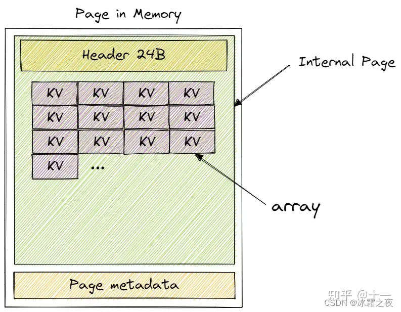

# BPlusTree

  1. 其中Tree Page Data就是 array_,存的是KV对。对于InternalPage存，<Key, pageid>, 对于LeafPage存 <key, record>.
  2. InternalPage：
     1. 第一个空位没有Key， 只有value, 查找是从 1 位置开始查找。0位置的意义是
     ，如从父结点key1定位到当前页面，则0位置代表>=key1, 但是小于1位置的值。
  3. LeafPage:
     1. 0位置有Key。 存不满， 当size == maxsize, 要进行分裂。 
    
# 代码核心函数
## Search
```cpp
INDEX_TEMPLATE_ARGUMENTS
auto BPLUSTREE_TYPE::FindLeaf(const KeyType &key, bustub::OPTYPE op, Transaction *transaction)  -> Page * {
  if(IsEmpty()){
    return nullptr;
  }
  auto page = buffer_pool_manager_->FetchPage(root_page_id_);
  //可能在得到根节点后，别的进程马上改变了根节点，所以要循环判断一下。
  while(1){
    if(page == nullptr){
      return nullptr;
    }
    if (op == bustub::OPTYPE::READ) {      
      page->RLatch();       
    } else {                     
      page->WLatch();       
    }
    transaction->AddIntoPageSet(page);
    if(root_page_id_ == page->GetPageId()) {
      break;
    }              
    UnlockAndUnpin(transaction, op);
    page = buffer_pool_manager_->FetchPage(root_page_id_);
  }
  auto pg = reinterpret_cast<BPlusTreePage *>(page->GetData());
  while(pg->IsInternalPage()){
    auto pid = (reinterpret_cast<InternalPage *>(pg))->FindKey(key, comparator_);
    auto new_page = buffer_pool_manager_->FetchPage(pid);
    if(op == bustub::OPTYPE::READ){
        //读操作，当获取子页面时，父页面就可以释放锁了。
        new_page->RLatch();
        UnlockAndUnpin(transaction, op);
    }else{
        new_page->WLatch();
        //写操作，要判断是否安全。
        //对于插入操作，只要判断再插入当前节点后不会引发向上分裂（两种页标准不同）, 就意味着安全。
        //对于删除操作，
          //若不是根节点则判断删除后大于等于minsize即可，
          //若是根节点，当只有一页时，安全。获知根节点size 》 2，安全。
        if(IsSafe(new_page, op) == true){
            UnlockAndUnpin(transaction, op);
        }
    }
    transaction->AddIntoPageSet(new_page);
    page = new_page;
    pg = reinterpret_cast<BPlusTreePage *>(page->GetData());
  }
  return page;
}
```
## Insert
```cpp
INDEX_TEMPLATE_ARGUMENTS
auto BPLUSTREE_TYPE::Insert(const KeyType &key, const ValueType &value, Transaction *transaction) -> bool {
  auto page = FindLeaf(key, bustub::OPTYPE::INSERT, transaction);
  //因为可能是空树， 所以要先申请一个根页。
  while(page == nullptr){
    latch_.lock();
    if(IsEmpty()){
      page_id_t pid;
      auto page = buffer_pool_manager_->NewPage(&pid);
      auto lpg = reinterpret_cast<LeafPage *>(page->GetData());
      lpg->Init(pid, INVALID_PAGE_ID, leaf_max_size_);
      SetRootPageId(pid);
      buffer_pool_manager_->UnpinPage(pid, true);
    }
    latch_.unlock();
    page = FindLeaf(key, bustub::OPTYPE::INSERT, transaction);
  }
  auto lpg = reinterpret_cast<LeafPage *>(page->GetData());
  bool res = lpg->Insert(key, value, comparator_);
  if(!res){
    UnlockAndUnpin(transaction, OPTYPE::INSERT);
    return false;
  }
  //先插入在判断是否达到了maxsize。
  if(lpg->GetSize() == leaf_max_size_){
    //申请一个新页
    page_id_t pid;
    auto new_page = buffer_pool_manager_->NewPage(&pid);
    auto new_lpg = reinterpret_cast<LeafPage *>(new_page->GetData());
    new_lpg->Init(pid, INVALID_PAGE_ID, leaf_max_size_);
    //做分列， 以maxsize / 2为分界点。
    lpg->Break(new_page);
    //像父节点插入新的页面。
    InsertToParent(page, new_page, new_lpg->KeyAt(0), transaction);
    buffer_pool_manager_->UnpinPage(pid, true);
  }
  UnlockAndUnpin(transaction, OPTYPE::INSERT);
  return true;
}
//像父节点插入
INDEX_TEMPLATE_ARGUMENTS
auto BPLUSTREE_TYPE::InsertToParent(Page *page, Page *new_page, const KeyType &key, Transaction *transaction) -> void{
  auto pg = reinterpret_cast<BPlusTreePage *> (page->GetData());
  auto npg = reinterpret_cast<BPlusTreePage *> (new_page->GetData());
  if(pg->IsRootPage()){
    //当分裂的节点时父节点时， 停止，插入完成。
    page_id_t pid;
    auto new_root = buffer_pool_manager_->NewPage(&pid);
    auto new_rtpg = reinterpret_cast<InternalPage *>(new_root->GetData());
    new_rtpg->Init(pid, INVALID_PAGE_ID, internal_max_size_);
    //在父节点设置好子节点
    new_rtpg->SetValueAt(0, page->GetPageId());
    new_rtpg->SetKVAt(1, key, new_page->GetPageId());
    new_rtpg->IncreaseSize(2);
    pg->SetParentPageId(pid);
    npg->SetParentPageId(pid);
    SetRootPageId(pid);
    buffer_pool_manager_->UnpinPage(pid, true);
    return ;
  }
  auto parent_pid = pg->GetParentPageId();
  auto parent_page = buffer_pool_manager_->FetchPage(parent_pid);
  auto parent_pg = reinterpret_cast<InternalPage *>(parent_page->GetData());
  //得到父节点，并且插入新页不用分裂，递归结束。
  if(parent_pg->GetSize() < parent_pg->GetMaxSize()){
    parent_pg->Insert(key, new_page->GetPageId(), comparator_);
    buffer_pool_manager_->UnpinPage(parent_pid, true);
    npg->SetParentPageId(parent_pid);
    return;
  }
  //父节点需要分裂
  page_id_t new_parent_pid;
  auto new_parent_page = buffer_pool_manager_->NewPage(&new_parent_pid);
  auto new_parent_pg = reinterpret_cast<InternalPage *>(new_parent_page->GetData());
  new_parent_pg->Init(new_parent_pid, INVALID_PAGE_ID, internal_max_size_);
  //父节点分裂，
    // key：new_page 的key
    // new_page: 新分裂出的子页
    // new_parent_page： 新创建的父节点兄弟
  //Break函数会根据key设置好new_page位置，并且将一半的KV放进新的父节点兄弟中，
  //此时问题变成了，父节点分裂成了两个，需要继续向上插入，-- 递归
  parent_pg->Break(key, new_page, new_parent_page, comparator_, buffer_pool_manager_);
  //继续向上递归
  InsertToParent(parent_page, new_parent_page, new_parent_pg->KeyAt(0), transaction);
  buffer_pool_manager_->UnpinPage(parent_pid, true);
  buffer_pool_manager_->UnpinPage(new_parent_pid, true);
}

```
## Remove
```cpp
  INDEX_TEMPLATE_ARGUMENTS
void BPLUSTREE_TYPE::RemoveEntry
(Page *page, const KeyType &key, Transaction *transaction){
  auto pg = reinterpret_cast<BPlusTreePage *>(page->GetData());
  //先根据页面种类删除KV， 失败则返回。这里执行删除操作
  //delete

  //到了根节点， 处理完递归结束
  if(pg->IsRootPage()){
    //变成空树
    if(pg->IsLeafPage() && pg->GetSize() == 0){
        SetRootPageId(INVALID_PAGE_ID);
        transaction->GetPageSet()->pop_back();
        page->WUnlatch();
        buffer_pool_manager_->UnpinPage(page->GetPageId(), true);
        buffer_pool_manager_->DeletePage(page->GetPageId());
        return;
    }
    //只剩一个KV， 就是0位置，则删除根节点， 让子节点成为新的根节点。
    // 根节点，且为中间节点，size最少为2，若只为1，说明其只有一个孩子，孩子应该为新的根，注意，此时孩子是没有锁的（因为已经解了），
    //但其它线程（事务）也是无法操作孩子，因为当前节点上着锁
    if(pg->IsRootPage() && pg->IsInternalPage() && pg->GetSize() == 1){
        auto ipg = reinterpret_cast<InternalPage *>(page->GetData());
        auto new_root_pid = ipg->ValueAt(0);
        //设置新节点，父节点
        auto new_root = buffer_pool_manager_->FetchPage(new_root_pid);
        auto new_rtpg = reinterpret_cast<BPlusTreePage *>(new_root->GetData());
        new_rtpg->SetParentPageId(INVALID_PAGE_ID);
        buffer_pool_manager_->UnpinPage(new_root_pid, true);
        //设置根节点
        SetRootPageId(new_root_pid);
        transaction->GetPageSet()->pop_back();
        page->WUnlatch();
        buffer_pool_manager_->UnpinPage(page->GetPageId(), true);
        buffer_pool_manager_->DeletePage(page->GetPageId());
        return;
    }
    transaction->GetPageSet()->pop_back();
    page->WUnlatch();
    buffer_pool_manager_->UnpinPage(page->GetPageId(), true);
    return;
  }

  //如果删除后，不满足最小KV要求，则进行如下处理
  if(pg->GetSize() < pg->GetMinSize()){
    auto parent_page = (*transaction->GetPageSet())[transaction->GetPageSet()->size() - 2]; 
    auto parent_pg = reinterpret_cast<InternalPage*>(parent_page->GetData());
    Page *brother_page = nullptr;
    KeyType merged_key_in_parent;
    bool ispre = false;
    //首先获得他的，兄弟节点
      //此函数中，先获取左兄弟节点， 若本身是第一个， 则获取第二个节点，当pre=true， 获取左边的兄弟。
      // merged_key_in_parent 父结点中指向右边页面的ke -- 详细在下面函数中。
    parent_pg->GetChildrenBrother(page->GetPageId(), merged_key_in_parent, &brother_page, ispre, buffer_pool_manager_);
    auto bpg = reinterpret_cast<BPlusTreePage *>(brother_page->GetData());
    auto tmp_size = pg->GetMaxSize();
    if(pg->IsLeafPage()){
      --tmp_size;
    }
    //若和兄弟节点可以合并
    if((bpg->GetSize() + pg->GetSize()) <= tmp_size){
      //保持相对位置
      if(!ispre){
        auto tpage = page;
        page = brother_page;
        brother_page = tpage;
        auto tpg = pg;
        pg = bpg;
        bpg = tpg;
      }

      if(pg->IsLeafPage()){
        auto leftpg = reinterpret_cast<LeafPage *>(brother_page->GetData());
        leftpg->Merge(page, buffer_pool_manager_);
        transaction->GetPageSet()->pop_back();
        brother_page->WUnlatch();
        buffer_pool_manager_->UnpinPage(leftpg->GetPageId(), true);
      }else{
        auto leftpg  = reinterpret_cast<InternalPage *>(brother_page->GetData());
        leftpg->Merge(merged_key_in_parent, page, buffer_pool_manager_);
        transaction->GetPageSet()->pop_back();
        brother_page->WUnlatch();
        buffer_pool_manager_->UnpinPage(leftpg->GetPageId(), true);
      }
      //合并完节点后， 原来右边的节点，需要继续向上删除。
      RemoveEntry(parent_page, merged_key_in_parent, transaction);
    }else{
      //不能合并， 则向兄弟节点借一个， 
      //这里向左右兄弟节点接时，处理不一样
      if(ispre){
        //向左边节点借一个。
        //删除左边节点最后一个， 插入到自己的第一个位置
        //调整孩子的父节点 - 中间节点需要
        //调整父节点， 右边的把之前的key，替换成新加的key， 左边不变。
        if(bpg->IsLeafPage()){
            //叶子节点不用处理子节点
            auto leftpg = reinterpret_cast<LeafPage *>(brother_page->GetData());
            auto rightpg =  reinterpret_cast<LeafPage *>(page->GetData());
            auto lstkey = leftpg->KeyAt(leftpg->GetSize() - 1);
            auto lstvalue = leftpg->ValueAt(leftpg->GetSize() - 1);
            // left
            leftpg->RemoveAtIndex(leftpg->GetSize() - 1);
            brother_page->WUnlatch();
            buffer_pool_manager_->UnpinPage(leftpg->GetPageId(), true);
            //right
            rightpg->InsertAtIndex(0, lstkey, lstvalue);
            transaction->GetPageSet()->pop_back();
            page->WUnlatch();
            buffer_pool_manager_->UnpinPage(pg->GetPageId(), true);
            //parrent
            int index = parent_pg->IndexKey(merged_key_in_parent, comparator_);
            parent_pg->SetKeyAt(index, lstkey);
        }else{
            auto leftpg = reinterpret_cast<InternalPage *>(brother_page->GetData());
            auto rightpg =  reinterpret_cast<InternalPage *>(page->GetData());
            auto lstkey = leftpg->KeyAt(leftpg->GetSize() - 1);
            auto lstvalue = leftpg->ValueAt(leftpg->GetSize() - 1);

            // left
            leftpg->RemoveAtIndex(leftpg->GetSize() - 1);
            brother_page->WUnlatch();
            buffer_pool_manager_->UnpinPage(leftpg->GetPageId(), true);
            // moved child
            auto child_page = buffer_pool_manager_->FetchPage(lstvalue);
            auto child_pg = reinterpret_cast<BPlusTreePage *>(child_page->GetData());
            child_pg->SetParentPageId(rightpg->GetPageId());
            buffer_pool_manager_->UnpinPage(child_pg->GetPageId(), true);
            //right
            rightpg->SetKeyAt(0, merged_key_in_parent);
            rightpg->InsertAtIndex(0, lstkey, lstvalue);
            transaction->GetPageSet()->pop_back();
            page->WUnlatch();
            buffer_pool_manager_->UnpinPage(pg->GetPageId(), true);
            //parrent
            int index = parent_pg->IndexKey(merged_key_in_parent, comparator_);
            parent_pg->SetKeyAt(index, lstkey);
        } 
      }else{
        //向右边兄弟接一个KV
        //删除右边兄弟的第一个，放到自己的最后一个
        if(bpg->IsLeafPage()){
            auto leftpg = reinterpret_cast<LeafPage *>(page->GetData());
            auto rightpg =  reinterpret_cast<LeafPage *>(brother_page->GetData());
            auto pushedkey = rightpg->KeyAt(1);
            auto fstkey = rightpg->KeyAt(0);
            auto fstvalue = rightpg->ValueAt(0);

            //right
            rightpg->RemoveAtIndex(0);
            brother_page->WUnlatch();
            buffer_pool_manager_->UnpinPage(leftpg->GetPageId(), true);
            //left
            leftpg->InsertAtIndex(leftpg->GetSize(), fstkey, fstvalue);
            transaction->GetPageSet()->pop_back();
            page->WUnlatch();
            buffer_pool_manager_->UnpinPage(pg->GetPageId(), true);  
            //parnet
            int index = parent_pg->IndexKey(merged_key_in_parent, comparator_);
            parent_pg->SetKeyAt(index, pushedkey);
        }else{
            auto leftpg = reinterpret_cast<InternalPage *>(page->GetData());
            auto rightpg =  reinterpret_cast<InternalPage *>(brother_page->GetData());
            auto pushedkey = rightpg->KeyAt(1);
            auto fstvalue = rightpg->ValueAt(0);

            //right
            rightpg->RemoveAtIndex(0);
            brother_page->WUnlatch();
            buffer_pool_manager_->UnpinPage(leftpg->GetPageId(), true);
            //moved child
            auto child_page = buffer_pool_manager_->FetchPage(fstvalue);
            auto child_pg = reinterpret_cast<BPlusTreePage *>(child_page->GetData());
            child_pg->SetParentPageId(leftpg->GetPageId());
            buffer_pool_manager_->UnpinPage(child_pg->GetPageId(), true);
            //left
            leftpg->InsertAtIndex(leftpg->GetSize(), merged_key_in_parent, fstvalue);
            transaction->GetPageSet()->pop_back();
            page->WUnlatch();
            buffer_pool_manager_->UnpinPage(pg->GetPageId(), true);  
            //parnet
            int index = parent_pg->IndexKey(merged_key_in_parent, comparator_);
            parent_pg->SetKeyAt(index, pushedkey);
        }
      }
    }
  }
}
```