# 可扩展哈希
## 性质
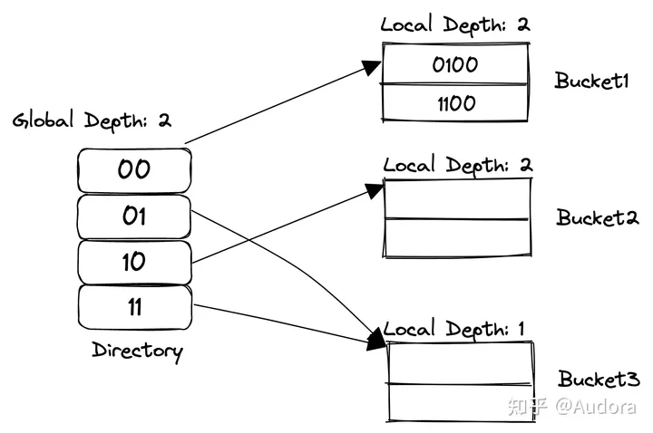
1. Global Depth：假设global depth为n，那么当前的directory必定有 
 个entry。例如，当前n=2，那么就有4个entry，n=3就有8个entry。同时，给定一个key，需要用global depth取出这个key的低n位的二进制值。例如，一个key的二进制是10111，如果global depth是3，通过IndexOf(key)函数，得到返回值的二进制值是111，即为7。这个值用来索引directory[111]位置的bucket。
2. Local Depth：local depth指的是（假设local depth为n），在当前的bucket之下，每个元素的key的低n位都是相同的。
3. 对于一个bucket来说，如果当前的global depth等于local depth，那说明这个bucket只有一个指针指向它。
4. 指向当前bucket指针数量为：2<sup>(global depth - local depth)</sup>
## 插入溢出处理
1. 如果溢出桶的本地深度等于全局深度，那么需要执行目录扩张和桶分裂， 然后全局深度和局部深度的值增加1。
2. 如果本地深度小于全局深度，那么仅仅发生桶分裂。然后仅仅把局部深度增加1。并且指定合适的指针。
## 核心代码
```cpp
//另外一次split可能依旧还会分到一个桶，所以要循环split直到成功
template <typename K, typename V>
auto ExtendibleHashTable<K, V>::Split(const K &key) -> void{
  auto bucket = dir_[IndexOf(key)];
  if(bucket->GetDepth() == GetGlobalDepthInternal()){
    // 等于全局桶深度，把全局桶复制到另一半。
    // 两半是对应的 例如 x=111 dep=2, index = 011, 当扩展后， index = 111, 即 011 + 4；
    size_t cap = dir_.size();
    dir_.resize(cap << 1);
    for(size_t i=0; i<cap; ++i){
      dir_[cap+i] = dir_[i];
    }
    //增加全局深度
    IncrementDepth();
  }
  auto bucket_new = std::make_shared<Bucket>(bucket_size_, bucket->GetDepth() + 1);
  auto bucket_old = std::make_shared<Bucket>(bucket_size_, bucket->GetDepth() + 1);
  //找到新扩出来的一位，当这一位时0，放在旧桶， 否则放在新桶。
  size_t mk = (1 << bucket->GetDepth());
  //需要用循环，因为可能不只有两个指针指向一个桶，要把他们全部都设置。
  for(size_t i=0; i<dir_.size(); ++i){
      if(bucket == dir_[i]){
          if((i & mk)){
            dir_[i] = bucket_new;
          }else{
            dir_[i] = bucket_old;
          }
      }
  }
  //找到新扩出来的一位，当这一位时0，放在旧桶， 否则放在新桶。
  for(auto &[k, v] : bucket->GetItems()){
    if(IndexOf(k) & mk){
        bucket_new->Insert(k, v);
    }else{
        bucket_old->Insert(k, v);
    }
  }
  //增加桶的数量。
  IncrementNumBuckets();
}
```
----
# Storage Manager
一个数据库系统由以下几个不同的部分组成

- Query Planning
- Operator Execution
- Access Methods
- Buffer Pool Manager
- Disk Manager

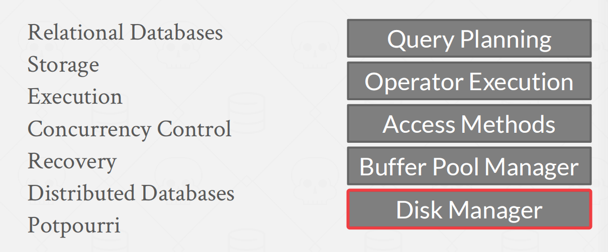

课程将从底层往上层介绍。这章介绍`Disk Manager`。

## Intro

DBMS假定数据库的主存储位置在非易失性磁盘上。

数据库中，内存和磁盘的结构和关系大致如下图，磁盘上的数据通常以 page 为单位进行组织，内存中维护了一个缓冲池 buffer pool，缓存了磁盘中的 page。

当上层的执行引擎需要读写数据时，首先从 buffer pool缓冲池中获取数据，如果 buffer pool 中没有，则从磁盘中加载到 buffer pool，然后返回到执行引擎中。

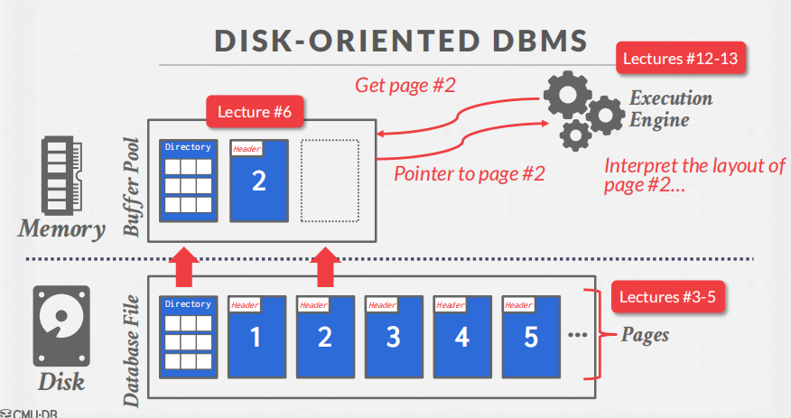

>  **为什么不直接使用操作系统呢？**

DBMS可以使用内存映射（mmap）将文件的内容存储到程序的地址空间中

`mmap`的概念：`mmap`是Unix/Linux系统提供的一种内存映射文件的机制，它允许一个进程将一个文件或者其他对象映射到进程的地址空间中，从而让进程可以直接读写这个文件或对象而无需进行文件IO操作。在内存映射文件中，进程的内存空间会被分为若干个页，每个页与文件中的若干个字节对应。当进程访问这些内存页时，对应的字节就会被自动读取或写入。

不使用的原因：

- 以正确的顺序将脏页刷到磁盘
- 特定的预读策略
- buffer 替换策略
- 线程/进程调度

总之，数据库系统希望自己对Disk进行管理。

##  File Storage

大多数数据库系统中的磁盘数据都是以 page 为单位组成。

**数据库Page是一个固定大小的数据块**，一个page能够保存任何东西，可以保存数据库里面的tuple，也可以保存元数据、索引、日志。每个 page 都有一个唯一的标识，称为 page id。

硬件page、操作系统page和数据库page：

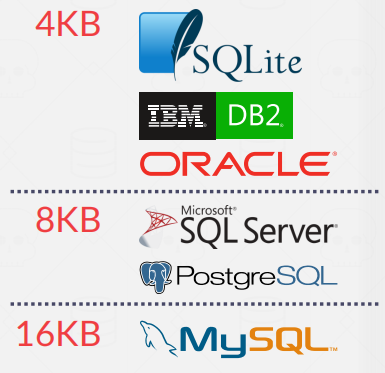

我们将怎么管理这些页呢？

不同的dbms以不同的方式管理磁盘上文件中的页面

- Heap File Organization 
- Tree File Organization 
-  Sequential / Sorted File Organization (ISAM) 
-  Hashing File Organization

> **Heap File**

堆文件是以随机顺序存储的元组的无序集合。

堆文件有2种组织方式

- linked list
- page directory

**Linked List**

linked list 是按照链表的方式组织 page。

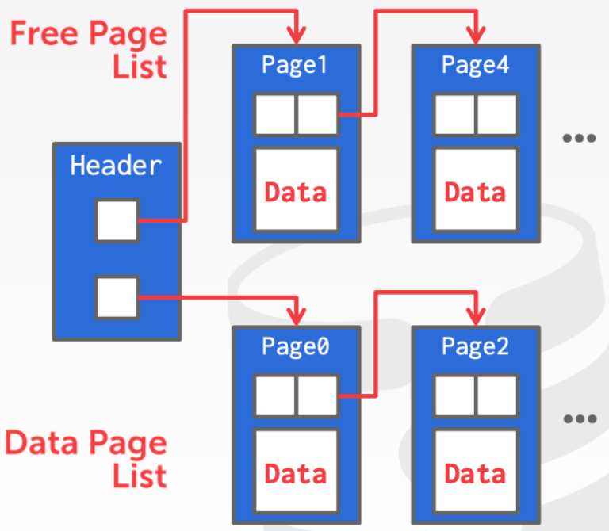

链表头有两个指针，一个指向 free page list，表示空闲的 page 列表，一个指向 data page list，指向实际存储数据的 page。


**Page Directory**

page directory 维护了一个特殊的 page，这个page存储着其他page的信息。

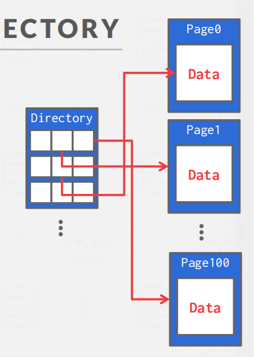

##  Page Layout

每个page都包含一个关于page内容的元数据的标题。

- header：保存一些元信息，比如 Page Size、checksum、dbms version、 Transaction Visibility等
- data：header 之后的部分叫做 slot array，每一个 solt array 都存储了 tuple 的开始位置，这样能够快速定位到每条记录。保存实际的tuple。

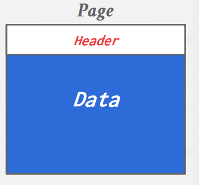

**Page 组织方式**

- Tuple-oriented
- Log-structured

> **Tuple-oriented**

跟踪页面中的元组数量，然后在末尾附加一个新的元组。

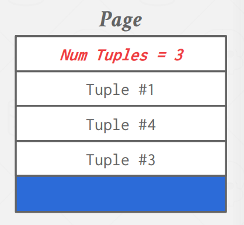

缺点：

- 删除操作需要遍历寻找空位
- 无法处理变长的数据记录（tuple）

因此，提出了 slotted page 。


**slotted page**

系型数据库中常用的组织方式叫做 slotted page，如下图所示。

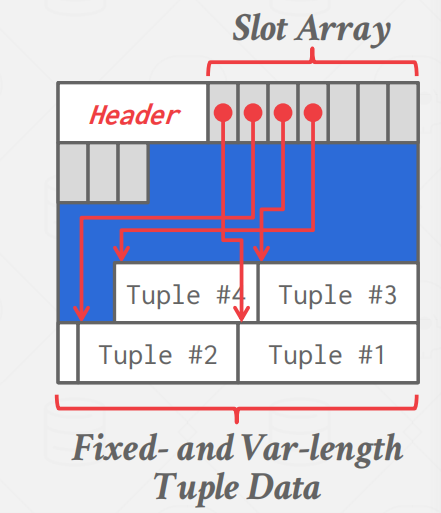

slotted  array将slotted 映射到tuple的起始位置偏移量。

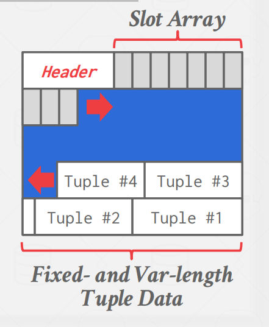

slot是从前往后，tuple是从后往前跟。

> **Log-structured**

DBMS存储包含对元组的更改（输入、删除）的日志记录，即存储这些如何创建tuple以及修改tuple的相关信息

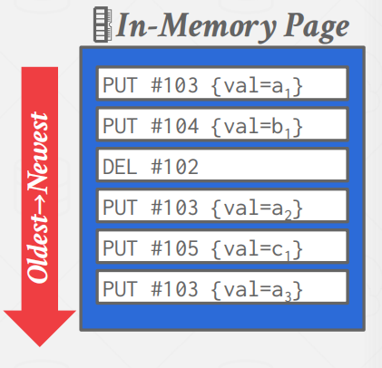

可以对日志进行压缩。

##  Tuple Layout

一个元组本质上是一个字节序列。

tuple 中还可以分为 header 和 attribute data 两部分。


heaher会存一些信息，例如tuple 的可见性（用于并发控制），用于判断 null 列的 bit map 等等。

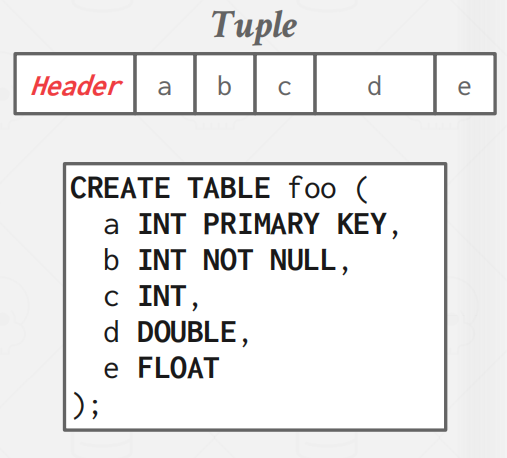

 **denormalize tuple data**

有时，为了提高操作性能。DBMS 会在存储层面上将有关联的表的数据预先 join 起来，称作 `denormalize`。


DBMS可以在物理上去规范化（例如，“预连接”）相关的元组，并将它们存储在同一个页面中。

- 可能会减少常见工作负载模式的I/O量
- 使更新的成本更高。

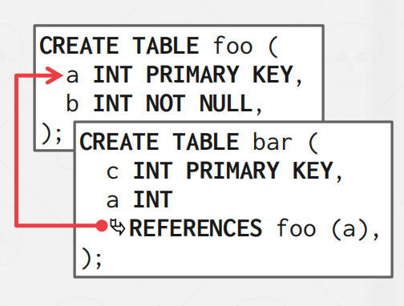

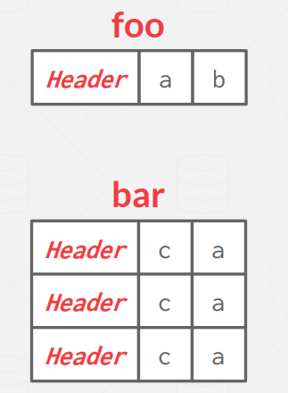

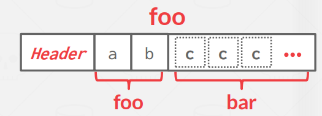


## **Storage Model**

OLTP，即 On-Line Transaction Processing，在线事务处理，其特征是读写简单，通常是读/写一小部分数据，并且事务可保证数据的一致性。

OLAP，即 On-Line Analytic Processing，在线分析处理，其特征是查询复杂，需要读取大批量数据进行统计分析。

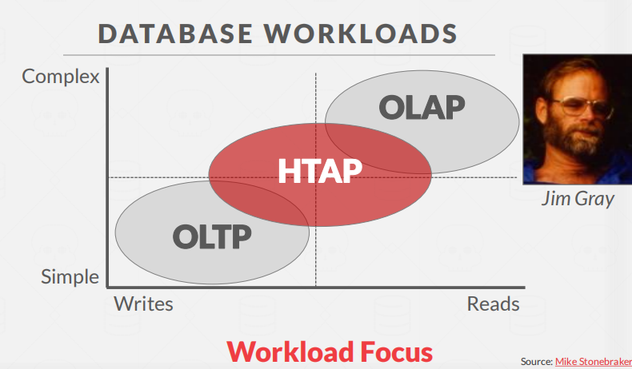

目前常见的数据存储模型包括：

- 行存储：N-ary Storage Model (NSM)
- 列存储：Decomposition Storage Model (DSM)

> **行存储**

NSM(行存储) 将一个 tuple 的所有属性在 page 中连续地存储，这种存储方式非常适合 OLTP 场景

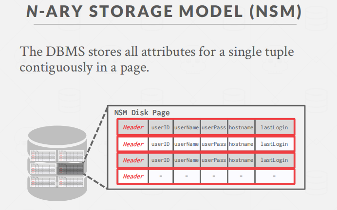

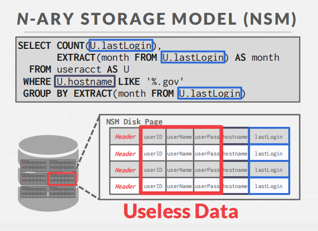

行存更适合OLTP，因为能够非常方便的更新或者获取到某一条（或几条）具体的数据（点查）。

> **列存储**

**列存储**：DBMS在页面中连续存储单个属性的值

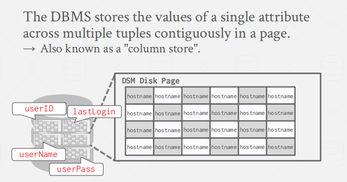

列存更适合 OLAP 类型的数据库。
----
# Buffer-Pool
Buffer Pool是从磁盘读取的页面的内存缓存（理解就是一块**内存区域**）。它本质上是在数据库内部分配的一个很大的存储区域，用来存储从磁盘获取的页面。

和OS类似，也是由于**局部一致性原理**。

**缓冲区池的内存区域被组织成一个固定大小的页面page数组**。每个数组条目都被称为一个**frame**。

此外，还需要维护一个 **page table**，它是一个哈希表，存储的是 page id 对 buffer pool 中 frame 的一个映射，此外还需要存储一些 page 的元数据信息，例如 page 是否为脏页、page 的引用计数等等。

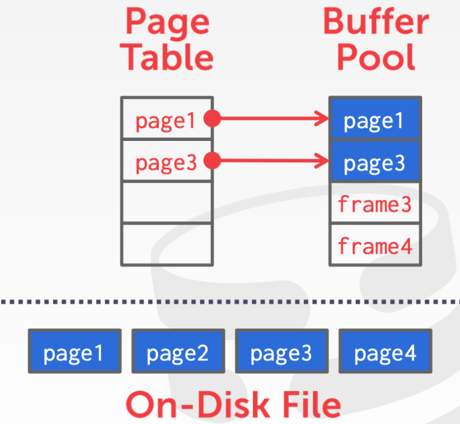

## Buffer  Pool Manager

有许多方法可以优化缓冲池，以适应应用程序的工作负载。

###  Multiple Buffer Pools

DBMS可以为不同的目的**维护多个缓冲池**（即每个数据库的缓冲池、每个页面类型的缓冲池）。然后，每个缓冲池都可以采用为存储在其中的数据而定制的本地策略。这个方法可以减少锁存器争用，提高局部性。

如何将所需的页面映射到缓冲区池？即实现一条tuple到buffer pools的映射。


2种方法： `object IDs`和`hashing`。

> **object IDs**

对象id涉及到将记录id扩展为具有对象标识符。然后，通过对象标识符，可以维护从对象到特定缓冲区池的映射。即，**Object ID 一般可以是一条 tuple 的隐藏列，它主要记录了 tuple 的磁盘存储位置**。

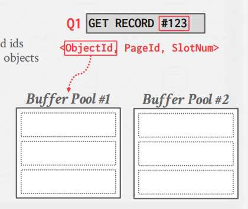

> **hashing**

**将tuple中的信息做hash，进行映射。**

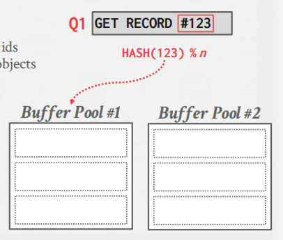 

###  Pre-fetching


DBMS还可以根据查询计划通过预抓取页面来进行优化。然后，**在处理第一组页面时，可以将第二组页面预取到缓冲池中**。DBMS在按顺序访问多个页面时，通常使用这种方法。

> **Sequential Scans**

简单的顺序扫描

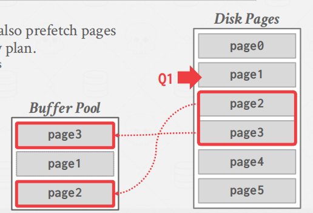

> **Index Scans**

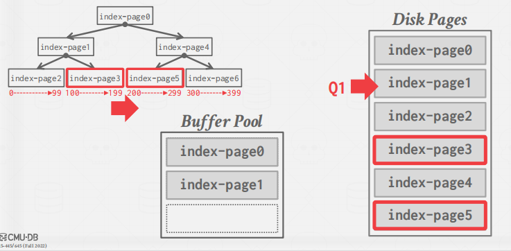

### **Scan Sharing**

scan sharing 的思路总体来说就是如果一个 query 想要扫描一个表，此时已经有另一个查询也正在扫描这个表了，那么可以将两个查询的操作合并起来，共享同一个 page 的内容。

### **Buffer Pool Bypass**

顺序扫描操作符将不会将获取的页面存储在缓冲池中，以避免开销。相反，内存对正在运行的查询是本地磁盘的。如果操作员需要读取磁盘上连续的大页序列，这将非常有力。（**简单来说，不需要Buffer Pool，直接扫磁盘**）

## Replacement Policer

当DBMS需要释放一个frame来为一个新page页面腾出空间时，它必须决定从缓冲区池中驱逐哪个页面。

我们的目标是：

- 正确
- 精确
- 速度
- 元数据开销


**sequential flooding含义**

例子

首先来了个select查询id=1的页，page0正好符合，将其放到缓冲池中。


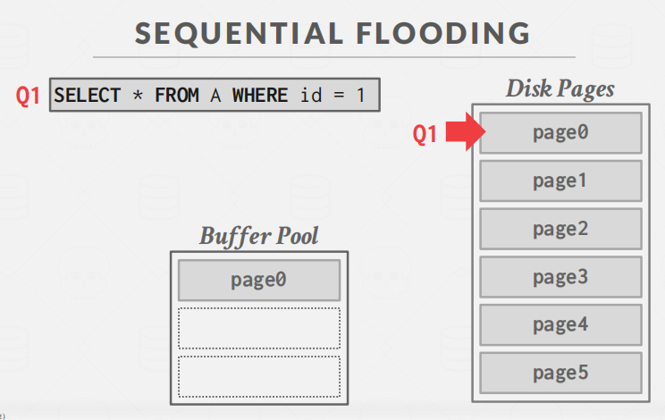

接着，这时又来了个查询2，不过这个查询是全表扫描。因此需要不断的加载数据到Buffer Pool中。

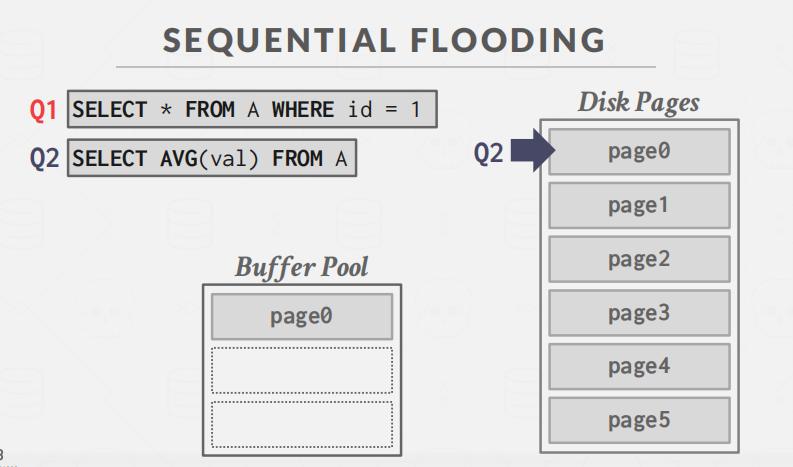

这时，查询Q2扫到page3，打算将其加入Buffer Pool中，但是Buffer Pool已经满了，因此选中一页替换出去。

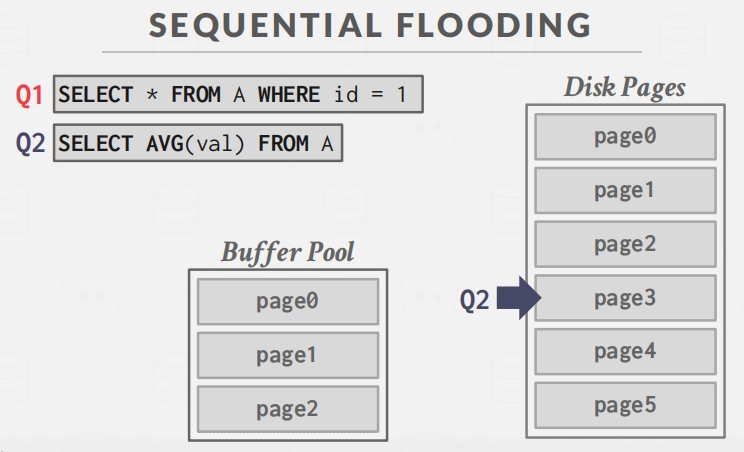

根据更新时间看，会把page0替换掉。

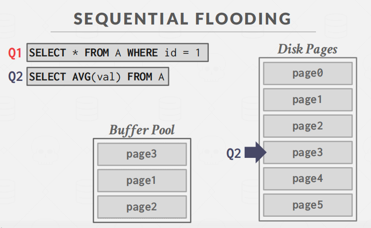

思考：page0替换到底是好还是不好？

答案是不好，因为page0属于热点页，即有人查询过，可能还会查询。

这时，来了个Q3执行Q1相同的操作，又得将page1拉到缓冲池中。


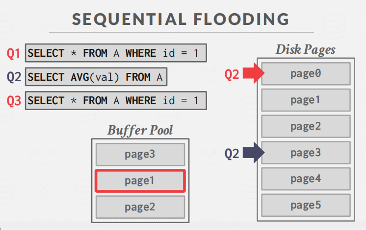

### LRU-K

前面提到的 LRU 算法虽然思路简单，但是也存在一些问题，如果一个频繁访问的热点 page，在短时间内被仅访问一次的页面所替换，那么会使缓存命中率下降，这种情况通常叫做缓存污染。

所以我们可以提升页面访问的次数上限，当达到 k 次时才能够替换其他的页面，所以不难理解传统的 LRU 算法可以看做是 LRU-1。


### Localization

根据Mondy老师的视频的意思是不要轻易驱逐其他操作的page，而优先驱逐自己的page。

### Priority Hints

DBMS在查询执行期间知道每个页面的上下文。它可以为缓冲区池提供关于**页面是否重要的提示**。简单说，就是给每个页加以重要程度。

例如一棵树那个页最重要

答案是**根节点**。

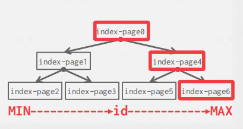

> **Dirty Page**

dirty page，即脏页，指的是缓存在 buffer pool 中的数据被修改了，但是还没有来得及写到磁盘中。每个 page 都有一个相应的标志位，来表示自己是否是脏页。

如果一个 page 不是脏页，那么在替换该 page 时，系统可以直接将它从 buffer pool 中移除，反之，则需要将 page 中的数据持久化。

一般我们可以启动一个后台进程，定期对脏页进行处理，当将脏页数据写到磁盘后，可以将脏页从 buffer pool移除，也可以直接重置 page 的脏页标志位。

## Other Memory Pools

这些其他内存池可能并不总是由磁盘支持的。取决于实现。

- Sorting + Join Buffers
- Query Caches
- Maintenance Buffers
- Log Buffers
- Dictionary Caches


 ----     

