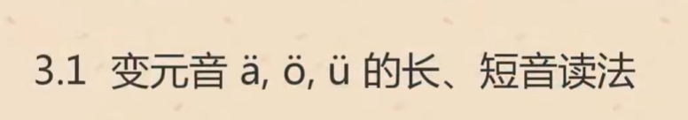
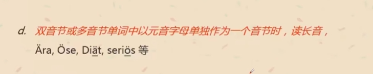
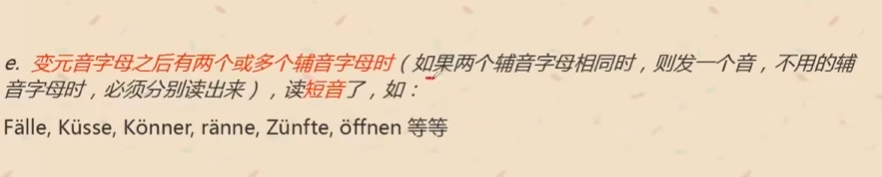
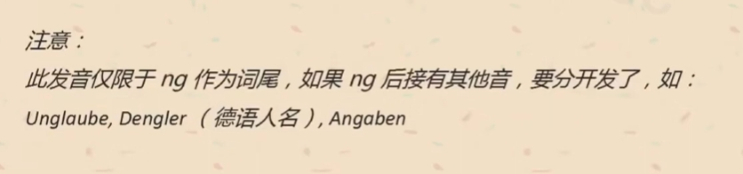

# 元音 a, e，i，o,u 发长音
    1. 单音节词以元音结尾 ： da, du, so, tu
    2. 元音后有不发音的h：ah, eh, oh, uh, geht, Kuh
    3. 元音字母重叠： aa, ee, ie=ii,
    4. 元音字母之后，只有一个辅音 ： gut, Tat, tun, Kino, Politik
    5. 双音节或多音节以元音字母单独作为一个音节：Oma, Omi, Opa, Alu, Ameisen

# 辅音字母 p b t d k g
    1. b, d, g 位于词尾变为 p, t, k; 
    2. dt , th 发 t 的音；
    3. ck -> k;

# l, r, m, n, s, sch
    1. l 与 元音 拼读 = 汉语拼音中的 l， la, lu
    2. r
    3. n, m = 汉语拼音 
    4. s 浊辅音 ’zei 一声‘
    5. sch  
    6. m,n 前面有元音， 后面没元音 - 汉语拼音
    7. l, r 前面有元音， 后面没元音

# a, e, i, o, u 短音
    1. a, i,  u 就是长音变短
    2. e 咧嘴 ’ai 1‘
    3. o 'ao 1'

--

--

--

       
# 2.2

--

--

--

--

--

--

--

# 2.3

--

--

--

--

--

--

--

# 2.4 大写字母用法 名词
    1. 名词 第一个字母 必须大写
    2. 句首第一个 大写
    3. 性， 数， 格
--

--

# 3
--

--

--

--

--

--

--

--

--

# 3.2 
--

--

--

# 3.3
--

--

--
 
--

--

--

--

--

--

# 词    
1. Tabak - 烟草
2. gut - 好的
3. rot - 红色的
4. du - 你
5. klug - 聪明的
6. Sie - 您
7. roh - 生的
8. so - 这样， 如此 
9. Vase - 花瓶，Vasen - , Novermber - 11
10. Tafel - 黑板， Fenster-窗， Fall-情形， Kaffee-咖啡
11. Wie geht's dir ? 最近好吗 ？
12. Gut, danke!, Und dir ? 不错 谢啦 你呢
13. Mir geht es schlecht(坏的) !! 我一点也不好啦
14. Tschuss; 再见;  Bis bald 回头见； Bitte - 回头见
15. Ich liebe dich 我爱你
 
